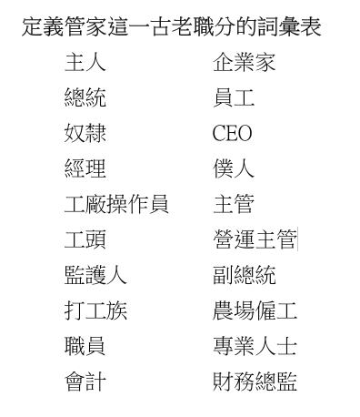

### 閱讀本週學課經文：
**帖前2：4**

**教學目的：**
*知曉：*明白管家職分在舊約聖經和新約聖經中的含義。
*感受：*引導學生在生活中感受擔任管家職分的個人呼召。
*行動：*學生自己列一份大綱，作為參與管家工作的指導。

**課文綱要：**
*I. 知曉：管家職分的定義*
甲、管家的角色在舊約和新約中有何差異？
乙、在聖經時代中，主人通常以何物託付管家？
丙、我們作為管家的職責是什麼？

*II. 感受：普遍的呼召*
甲、在我們所生活的現代世界裡，我們如何忠心地履行自己的使命？
乙、我們如何才能體驗到聖經中的忠心管家對使命的無比熱情呢？

*III. 行動：管理模式*
甲、聖經中有哪些管理模式之要素可以讓我們將其納入現代管理範疇中？
乙、在我們個人的管理計劃綱要中，必須涵蓋生活中的哪些重要領域？
丙、應當如何向家人和朋友解釋我們的管理決策，尤其是那些與我們意見相左的人？

**總結：**
聖經中記載了許多忠實信徒的故事，從中我們可以看出管家職分的基本要素已經深深根植於他們的生命中。管家的火炬代代相傳，如今輪到我們。要作忠實的管家，將火炬傳給跟隨我們的下一代。

**教學過程：**

*教學過程分為四步驟：*引起動機、探索、應用與設計創意性的活動。

### 第一步—引起動機

**重點經文：帖前2：4**

*靈性成長的重要觀念：*但凡忠心的管家，都一心一意地將他們的監督者──上帝及其最大利益放在心上。

*致教師的建議：*本週透過學習舊約和新約聖經中的例子，來研究管家職分在聖經中的含義。管理的工作是以聖經原則為基礎的。現代的管家力圖在當代背景下體現其寶貴價值，並用他們的對主的熱情影響未來的管家。

*自由討論：*管家一詞在當代詞彙中並不常見。在由社會主義、共產主義和民主企業經濟體制主導的現代世界中，極少存在需要管家的社會環境。閱讀下面的列表，詢問班上的學員，看看哪一種身份的概念最接近於管家這種古老的角色。請他們就其答案稍作解釋。

你可以根據所處的社會環境，將描述管家職分更為適合的詞彙加入列表，將不合適的詞刪除。全班集思廣益，將最佳答案整理出來。將這些詞彙與你在課程學習中所學到的聖經中管家特點作對比。如有可能，將你的想法寫下來，以供全班同學參考。

### 第二步—探索

*致教師的建議：*本週的學習重點是從聖經的角度建構對管家的理解。顯然，只有理解管家的基礎才能獲得對其衍生詞的準確理解。我們以新舊約為基礎，仔細研究管家的活動與職責，以此定義管家的職分。

**聖經注釋：**

*I. 管家的一生（和班上的學生一起複習創2：15；24：34-38；39：4；43：19；賽22：14-18；路12：35-48；林前4：1、2；多1：7；彼前4：10。）*

N•阿維加得教授發現了一個位於橄欖山斜坡上的墳墓，經考證為先知以賽亞（賽22：14-18）所描述的舍伯那的墓。墓碑如今被大英博物館收藏，其上銘文的內容是：「這是『舍伯那的墓穴』耶戶，他是在屋裡的人。」（詳情請見《基督復臨安息日會聖經注釋》卷四，第191頁。）

「在屋裡的人」這種表述方式就是舊約時代指代管家的用語。各種聖經譯本採用不同的詞彙來描述舍伯那的職位，都暗指他職責的不同方面。有些較為現代的譯本使用「管家」一詞（ESV，TLV，RSV，NRSV，NASB，HCSB，NKJV，NIV等聖經譯本），而最新的譯本在選詞方面更為創意──「官員」（CEB），「監管人」（VOICE），「宮務大臣」（NLT），「經理」（NCV），「僕人」（NCV），甚至還出現了「總理」（CEV）。較為古老的譯本則使用「掌銀庫的」（KJV，ASV，AMPC，MEV等聖經譯本）。許多譯本都使用了「負責」（GW，NASB）或「照管」（NLV）等動詞來說明管家的職責。 

這樣看來，舊約時代的管家被看作家庭成員，與其主人同住。他們的確是僕人的身份，但卻不是好似奴隸一般的卑微傭人。他們管理主人的家業，可能也領導一些身份較低的僕人工作。家庭日程是管家的分內之事，也可能擁有財政權力，甚至有些人還被認為是政府「官員」。

到了新約時代，被譯為管家的希臘文有兩個。更為常用的是oikonomos，在聖經中出現過十次，另一個是epitropos，只出現過三次。Oikonomos是一個組合詞──oikos，表示家庭，而nomō，則代表「管理」，或「使之有序」。所以管家就是一個將房間打理得井井有條的人。epitropos除了與oikonomos同義之外，也指政府官員或兒童監護人。在加拉太書4：2中，就既使用了epitropos，也用了oikonomos。新約對於管家一詞的獨特貢獻在於不僅使用其字面含義，也用它來比喻屬靈的事。下一節我們將更深入地探討這一比喻用法。

*思考問題：*
`管家雖然肩負重大責任，但其身份仍是僕人，理解這一事實如何提升我們對於基督徒僕人或基督教服務的認識？`

*II. 管理屬靈真理（和班上的同學一起複習林前4：1、2；多1：7；彼前4：10；西2：2、3；提前3：16。）*

和舊約聖經一樣，新約使用了管家一詞的字面意義，但同時它也擴展其含義，用於指代管理屬靈真理，即保羅所說，上帝的奧秘。管家在保羅寫給哥林多教會的書信中是福音的使者，在給提多的信中指教會領袖，特別是長老和監督。彼得則用它指代所有信徒。讓我們仔細思考上帝所承擔的風險：祂屬靈財富的永恒寶藏被我們裝在有限的土罐中──就是我們這個終將腐朽的肉體。

仔細思考這一屬靈恩賜賦予我們的責任。雖然保羅所說要做上帝福音忠實管家的勸誡極為重要，但他身為管家的一生則對我們更有助益。儘管面臨著無法想像的艱難險阻，但他仍舊下定決心要在越來越廣闊的天地中忠實地傳揚福音。他是這樣描述自己的經歷：「我比他們多受勞苦，多下監牢，受鞭打是過重的，冒死是屢次有的。被猶太人鞭打五次，每次四十減去一下；被棍打了三次；被石頭打了一次，遇著船壞三次，一晝一夜在深海裡。又屢次行遠路，遭江河的危險、盜賊的危險，同族的危險、外邦人的危險、城裡的危險、曠野的危險、海中的危險、假弟兄的危險。受勞碌、受困苦，多次不得睡，又飢又渴，多次不得食，受寒冷，赤身露體。除了這外面的事，還有為眾教會掛心的事，天天壓在我身上。有誰軟弱，我不軟弱呢？有誰跌倒，我不焦急呢？」（林後11：23-29） 

保羅全然接受了他管理福音的責任，千方百計要確保完成大使命。

*思考問題：*
`縱觀歷史，思想保羅以及許多先賢在管理屬靈真理的事上為我們留下的寶貴教訓。那麼在我死後，能為後人留下怎樣的精神遺產呢？`

### 第三步—應用

*致教師的建議：*上帝對人類的信任，是語言無法詳述的。失喪靈魂的命運懸而未決。我們的每一個選擇若非推進上帝的使命，要不就拖了後腿。誰才能勝任這些工作呢！基督本可以將祂的寶物託付給天使，或是呼召那些從未犯罪的諸世界居民。祂本可以將人類盡數摧毀，再重新打造一個新世界。但祂都沒有這樣做。相反，祂選擇犧牲自己的性命，祂要依靠我們，呼召在這個世界上願作祂恩典的忠實管家之人來完成使命。

**思考／應用問題：**
`1. 現代基督徒如何才能對保羅和基督的門徒們，在管理屬靈真理事上所懷有的熱忱感同身受？`
`2. 在當代社會中，身為上帝忠實管家的顯著特徵是什麼？`
`3. 我們應該採取哪些措施才能保證基督的利益是至高無上的，而我們的利益只在其次？`
`4. 聖靈給了我們哪些應許，來鼓勵我們擔起基督徒的管理職分？`
`5. 保羅說我們不是自己的人，因為我們是重價買來的。這一教訓如何激勵基督徒去做管家的工作？`
`6. 作為上帝忠實的管家，我們如何擴大自己的影響力使得其他人也能效法我們的榜樣？`

### 第四步—設計創意性的活動

*致教師的建議：*我們的確是上帝的管家，但更重要的是，我們是祂百般恩賜的管家。兩者相輔相成。上帝所賜下的物質和靈性的資源，可以藉著那些希望成為福音忠實管家之人的手，有效地運用於推進上帝大使命的工作。

**活动：**
1. 圍繞今日話題準備一份大綱，屆時可與青年人一起分享。可以講講你個人的信仰之旅，坦誠地談談那些曾為了自己的興趣而將上帝的利益擺在一邊的日子。也可以分享當你將上帝的利益擺在首位時，祂是如何在物質和靈性上都厚賜予你的。
2. 研究一下你所在的社區有什麼需求，選擇其中一項，用上帝所賜你的獨特天賦與才幹為它帶來改變。