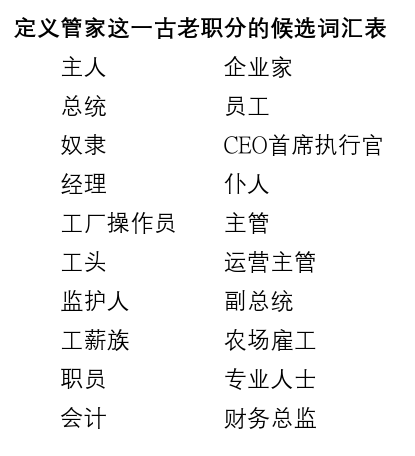

### 阅读本周学课经文：
**帖前2：4**

**教学目的：**
*知晓：*明白管家职分在旧约圣经和新约圣经中的含义。
*感受：*引导学生在生活中感受担任管家职分的个人呼召。
*行动：*学生自己列一份大纲，作为他／她参与管家工作的指导。

**课文纲要：**
*I. 知晓：管家职分的定义*
甲、管家的角色在旧约和新约中有何差异？
乙、在圣经时代中，主人通常以何物托付管家？
丙、我们作为管家的职责是什么？

*II. 感受：普遍的呼召*
甲、在我们所生活的现代世界里，我们如何忠心地履行自己的使命？ 
乙、我们如何才能体验到圣经中的忠心管家对使命的无比热情呢？

*III. 行动：管理模式*
甲、圣经中有哪些管理模式的要素，我们需要将其纳入现代管理之框架中？
乙、在我们个人的管理计划纲要中，必须涵盖生活中的哪些重要领域？
丙、应当如何向家人和朋友解释我们的管理决策，尤其是那些与我们意见相左的人？

**总结：**
圣经中记载了许多忠实信徒的故事，从中我们可以看出管家职分的基本要素已经深深根植于他们的生命中。管家的火炬代代相传，如今轮到我们了。要作忠实的管家，将火炬传给跟随我们的下一代。

**教学过程：**

*教学过程分为四步骤：*引起动机、探索、应用与设计创意性的活动。

### 第一步—引起动机

**重点经文：帖前2：4**

*灵性成长的重要观念：*但凡忠心的管家，都一心一意地将他们的监督者——上帝——的最大利益放在心上。

*致教师的建议：*本周通过学习旧约和新约圣经中的例子，来研究管家职分在圣经中的含义。管理的工作是以圣经原则为基础的。现代的管家力图在当代背景下体现其宝贵价值，并用他们的对主的热情感染未来的管家。

*自由讨论：*管家一词在当代词汇中并不常见。在由社会主义、共产主义和民主企业经济体制主导的现代世界中，极少存在需要管家的社会环境。阅读下面的列表，询问班上的学员，看看哪一种身份的概念最接近于管家这种古老的角色。请他们就其答案稍作解释。

你可以根据所处的社会环境，将描述管家职分更为适合的词汇加入列表，将不合适的词删除。全班集思广益，将最佳答案整理出来。将这些词汇与你在课程学习中所学到的圣经中管家的特点作对比。如有可能，将你的想法写下来，以供全班同学参考。

### 第二步—探索

*致教师的建议：*本周的学习重点是从圣经的角度构建对管家的理解。显然，只有在理解了管家的基础上才能获得对其衍生词管家职分的准确理解。我们以新旧约为基础，仔细研究管家的活动与职责，以此定义管家的职分。

**圣经注释：**

*I. 管家的一生（和班上的学生一起复习创2：15；24：34-38；39：4；43：19；赛22：14-18；路12：35-48；林前4：1、2；多1：7；彼前4：10。）*

N•阿维加得教授发现了一个位于橄榄山斜坡上的坟墓，经考证为先知以赛亚（赛22：14-18）所描述的舍伯那的墓。墓碑如今被大英博物馆收藏，其上铭文的内容是：“这是‘舍伯那的墓穴’耶户，他是在屋里的人。”（详情请见《基督复临安息日会圣经注释》卷四，第191页。）

“在屋里的人”这种表述方式就是旧约时代指代管家的用语。各种圣经译本采用不同的词汇来描述舍伯那的职位，都暗指他职责的不同方面。有些较为现代的译本使用“管家”一词（ESV，TLV，RSV，NRSV，NASB，HCSB，NKJV，NIV等圣经译本），而最新的译本在选词方面更为创意——“官员”（CEB），“监管人”（VOICE），“宫务大臣”（NLT），“经理”（NCV），“仆人”（NCV），甚至还出现了“总理”（CEV）。较为古老的译本则使用“掌银库的”（KJV，ASV，AMPC，MEV等圣经译本）。许多译本都使用了“负责”（GW，NASB）或“照管”（NLV）等动词来说明管家的职责。  

这样看来，旧约时代的管家被看作家庭成员，与其主人同住。他们的确是仆人的身份，但却不是好似奴隶一般的卑微佣人。他们管理主人的家业，可能也领导一些身份较低的仆人工作。家庭日程是管家的分内之事，也可能拥有财政权力，甚至有些人还被认为是政府“官员”。

到了新约时代，被译为管家的希腊文有两个。更为常用的是oikonomos，在圣经中出现过十次，另一个是epitropos，只出现过三次。Oikonomos是一个组合词——oikos，表示家庭，而nomō，则代表“管理”，或“使之有序”。所以管家就是一个将房间打理得井井有条的人。epitropos除了与oikonomos同义之外，也指政府官员或儿童监护人。在加拉太书4：2中，就既使用了epitropos，也用了oikonomos。新约对于管家一词的独特贡献在于，不仅使用其字面含义，而且用它来比喻属灵的事。下一节我们将更深入地探讨这一比喻用法。 

*思考问题：*
`管家虽然肩负重大的责任，但其身份仍是仆人，理解这一事实如何提升我们对于基督徒仆人或基督教服务的认识？`

*II. 管理属灵真理（和班上的同学一起复习林前4：1、2；多1：7；彼前4：10；西2：2、3；提前3：16。）*

和旧约圣经一样，新约使用了管家一词的字面意义，但同时它也扩展其含义，用于指代管理属灵真理，即保罗所说，上帝的奥秘。管家在保罗写给哥林多教会的书信中是福音的使者，在给提多的信中指教会领袖，特别是长老和监督。彼得则用它指代所有信徒。让我们仔细思考上帝所承担的风险：祂属灵财富的永恒宝藏被我们装在有限的土罐中——就是我们这个终将腐朽的肉体。

仔细思考这一属灵恩赐所赋予我们的责任。虽然保罗所发出的要做上帝福音忠实管家的劝诫极为重要，但他身为管家的一生则对我们更有帮助。尽管面临着无法想象的艰难险阻，但他仍旧下定决心要在越来越广阔的天地中忠实地传扬福音。他是这样描述自己的经历的：“我比他们多受劳苦，多下监牢，受鞭打是过重的，冒死是屡次有的。被犹太人鞭打五次，每次四十减去一下；被棍打了三次；被石头打了一次，遇着船坏三次，一昼一夜在深海里。又屡次行远路，遭江河的危险、盗贼的危险，同族的危险、外邦人的危险、城里的危险、旷野的危险、海中的危险、假弟兄的危险。受劳碌、受困苦，多次不得睡，又饥又渴，多次不得食，受寒冷，赤身露体。除了这外面的事，还有为众教会挂心的事，天天压在我身上。有谁软弱，我不软弱呢？有谁跌倒，我不焦急呢？”（林后11：23-29）

保罗全然接受了他管理福音的责任，千方百计要确保完成大使命。

*思考问题：*
`纵观历史，思想保罗以及许多先贤在管理属灵真理的事上为我们留下的宝贵教训。那么在我死后，能为后人留下怎样的精神遗产呢？`

### 第三步—应用

*致教师的建议：*上帝对人类的信任用语言根本无法描述。失丧灵魂的命运悬而未决。我们的每一个选择要么推进上帝的使命，要么就拖了后腿。谁才能胜任这些工作呢！基督本可以将祂的宝物托付给天使，或是呼召那些从未犯罪的诸世界的居民。祂本可以将人类尽数摧毁，再重新打造一个新世界。但祂都没有这样做。相反，祂选择牺牲自己的性命，祂要依靠我们，呼召在这个世界上作愿祂恩典的忠实管家之人来完成使命。

**思考／应用问题：**
`1. 现代基督徒如何才能对保罗和基督的门徒们在管理属灵真理事上所怀有的热忱感同身受？`
`2. 在当代社会中，身为上帝忠实管家的显著特征是什么？`
`3. 我们应该采取哪些措施才能保证基督的利益是至高无上的，而我们的利益只在其次？`
`4. 圣灵给了我们哪些应许，来鼓励我们担起基督徒的管理职分？`
`5. 保罗说我们不是自己的人，因为我们是重价买来的。这一教训如何激励基督徒去做管家的工作？`
`6. 作为上帝忠实的管家，我们如何扩大自己的影响力使得其他人也能效法我们的榜样？`

### 第四步—设计创意性的活动

*致教师的建议：*我们的确是上帝的管家，但更重要的是，我们是祂百般恩赐的管家。两者相辅相成。上帝所赐下的物质和灵性的资源，可以借着那些希望成为福音忠实管家之人的手，有效地运用于推进上帝大使命的工作上。

**活动：**
1. 围绕今日话题准备一份提纲，届时可与青年人一起分享。可以讲讲你个人的信仰之旅，坦诚地谈谈那些曾为了自己的兴趣而将上帝的利益摆在一边的日子。也可以分享当你将上帝的利益摆在首位时，祂是如何在物质和灵性上都厚赐予你的。
2. 研究一下你所在的小区有什么需求，选择其中一项，用上帝所赐你的独特的天赋与才干为它带来改变。