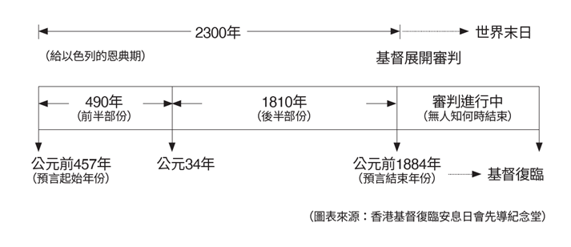

下列圖表顯示了但9：24－27七十個七與但8：14之中2300年兩者預言的關聯性為何，又是如何形成後者的起始點。若你從主前457年起計算2300年（記得刪除不存在的0年），就會得出1844年；或者你若從主後34年起計算剩餘的1810年（2300減去前面的490年），你也會得出1844年。因此在但以理書8：14中聖所的潔淨顯示出是在1844年開始。

請注意1844年的日期如何與我們在但以理書第7和第8章中所看到的相符。但以理書第7章的審判，與但以理書第8章的聖所被潔淨是同一件事（見前兩週的學課），是經歷了1260年的迫害之後才發生（但7：25），時間點卻是在耶穌復臨並建立祂永恆國度之前。

**討論問題**

`1. 學者們肯定地說2300日與七十個七實際上指的是同一個預言。他們為何這麼說？你可以找到什麼證據來支持這種主張？`

`2. 我們可以從但以理的代禱中學到什麼功課，來幫助我們自己代禱的生活？`

`3. 基督為我們所作的犧牲是我們唯一的希望。這如何幫助我們保持謙卑，更重要的是讓我們更愛人和寬恕人？路7：40－47想對我們說些什麼？`

`4. 看看《聖經》對但以理的祈禱和盼望而言有多麼重要！他的國家慘敗，人民被流放，土地被蹂躪，首府被摧毀；儘管景況淒慘，他仍抱持希望──他的同胞有朝一日會回家。除了《聖經》和上帝的應許之外，他還從哪裡得到這種希望呢？這如何教導我們可以從聖經的應許中得到希望？`
