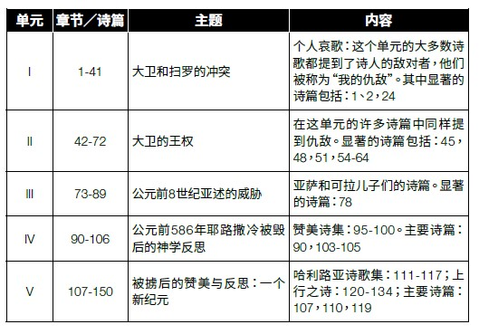

### 第一部分：综览

**关键经文：路24：44**

诗篇，也被称为诗篇集，是希伯来诗歌的巅峰之作。诗篇是一卷鼓舞人心的诗歌集，表达了信徒们从以色列君王时期（公元前10世纪）到被掳后期（公元前5世纪）的各种感受和挣扎。诗篇包含多种体裁：感恩之歌、赞美之歌、悔改之歌、拯救之歌、保护之歌、咒诅诗、对上帝创造大工的默想等。本季我们对诗篇的仔细探究将力求反映这种丰富的多样性。

**学课主题**
作为本季学课的介绍，我们将涉及以下初步主题：
①.	诗篇的历史背景
②.	诗篇的体裁或类别
③.	敬拜的指导
此外，我们将透过探讨以下主题来扩大对诗篇的研究：🅐诗篇的结构；🅑诗篇作者用来表达情感的各种文学工具；以及🅒诗篇中的诗歌分类。

### 第二部分：注释

**编辑优美的“教会赞美诗”**
诗篇是公元前5世纪所编辑的各种诗歌，以斯拉和他的文士同侪是最有可能的编辑。

诗篇被划分为五个较小的单元，显示编辑们按着时间和历史顺序以主题方式来编辑诗歌（见下表）：

今天，我们的教会有自己的敬拜诗歌集，即基督复临安息日会《赞美诗》。如果你查阅该《赞美诗》后面的索引，你会发现歌曲是按主题分类的。诗篇也有类似的分类，尽管它是按时间顺序而非按主题排列。

当我们为敬拜祂而作好预先的准备，上帝会很喜悦。我们必须努力把最好的献给祂。这个原则不仅适用于崇拜聚会的形式，也适用于聚会的计划和组织。尽管现代思想和流行趋势提倡更自由的敬拜方式，诗篇表明我们在敬拜上帝时必须有组织有秩序。

与此同时，秩序和组织绝不排除多样性，我们应该寻求将两者结合到我们的崇拜聚会中。为了帮助我们进行这项工作，我们须考量纵览所提及的诗篇分类。我们首先要注意诗篇的五个单元中的每一部分都以赞美或赞美诗作为结束；即：诗41，72，89，106和诗150。

诗1的主题聚焦于妥拉，而诗2则聚焦于弥赛亚的国度，这两者都是诗篇的主要主题。一些《圣经》学者认为这两首诗篇构成了这本赞美诗集的序言。

我们也注意到某些显要的诗篇（诗2，72和诗89）在书中的位置非常具体且突出。许多神学家认为诗89是整卷诗篇的中心，因为它着重于大卫王朝失败后，以色列人将盼望转向耶和华。

诗篇的第五单元，由最后五篇诗篇组成，以赞美为中心。这五篇诗篇以“哈利路亚”或“赞美耶和华！”开头，作为它们开始和结束。这些诗篇充满了热情的赞美：将荣耀上帝作为敬拜的行为（诗146：1、2；147：12；148：1-5，7，13、14；诗149：3，6；诗150：1-6）；向耶和华歌唱（诗147：7；149：1）；以耶和华“为有福”（诗146：5）；愿锡安的民因他们的王快乐（诗149：2）；并“因所得的荣耀高兴”（诗149：5）。

可以安排用来赞美上帝的诗歌是多么美好的特权啊！我们对诗歌的选择应该有明确的目标，就是要敬拜耶和华，高举祂的恩典。

**创作精美的诗篇**
仔细研究每一篇诗篇，就会发现它独特的美。诗篇作者采用各种文学技巧来创作自己的诗篇。他们经常使用的表达方式包括修辞手法，例如“明喻”和“拟人化”。明喻是将两个不同的事物明确地进行比较的一种表达方式，通常使用“像”或“如”这类词汇（诗1：3）。拟人化是将人的形式或属性赋予非人类的事物，尤其是神灵（诗18：8-10）。

诗篇作者也使用了涉及替代的文学手法或表达方式，例如“转喻”，一种用一个物体或概念的名称代替与之相关的另一物体或概念名称的修辞手法（诗2：5）；“提喻”，一种用部分代替整体，或用整体代替部分，或用特殊代替一般，或用一般代替特殊的修辞手法（诗44：6）和咒诅（诗109：7）。诗篇作者也采用“离合诗”形式（诗119），这是一种诗歌形式，每一节开头的第一个字母按字母顺序排列。我们也看到在一首诗或一首歌的前两节或更多节的开头使用首语重复法（诗136）。此外，我们也看见一些省略或抑制手法，从一个主题突然跳到另一个主题（诗21：12）；“顿絶法”，故意中断一个句子并使其未完成，给人以不愿或无法继续的印象（诗6：3）；“反问法”，使用修辞问题（仅用于产生效果或作出肯定或否认，而不是为了引出回答；如诗106：2等）。

诗篇作者使用的所有这些修辞和文学手法，皆展示了文学的精妙和无与伦比的技巧。

**多种类型的诗篇**
星期二的课程提供了诗篇的一般分类。以下是对诗篇旋律的更详细的分类，当然也有可能还有其他可接受的分类：

①.	赞美诗
- 一般赞美诗：诗8、29、33、100、103、104、111、113、114、117、135、136、145-150。
- 历史赞美诗：诗78、105。
- 锡安赞美诗：诗46、48、76、87、122。
- 王权赞美诗：诗47、93、96-99。

②.	哀歌
- 个人哀歌：诗3、5、6、7、12、13、17、22、25、26、28、31、35、36、38、39、43、51、54、55-57、59、61、63、64、69-71、86、88、102、109、120、130、140-143。
- 群体哀歌：诗44、60、74、77、79、80、82、83、85、90、94、106、108、123、126、137。

③.	其他形式
- 王室诗篇：诗2、18、20、21、45、72、89、101、110、132、144。
- 个人感恩：诗9、10、30、32、34、40、41、92、107、116、138。
- 群体感恩：诗65-68、118、124。
- 个人的信心诗篇：诗4、11、16、23、27、62、84、91、121、131。
- 群体的信心诗篇：诗115、125、129、133。
- 礼拜仪式：诗15、24、134。
- 先知劝勉：诗14、50、52、53、58、75、81、95。
- 教导式诗篇：诗1、19、37、49、73、112、119、127、128、139。

这个列表说明诗篇乃是由个人诗歌和群体诗歌所组成。今天，西方文化强调个人。然而，希伯来人的思想专注于一种社区意识，这是作为今日基督徒的我们所不能忽视的一个因素，特别是考量到作为一个教会，我们是一个全球性组织，肩负着全球使命。

上述分类为我们提供的最后一个观察是，诗篇适用于生活中的所有不同场合：群体和个人敬拜的诗歌、王室诗歌、上行之诗以及礼拜仪式的诗歌。对《圣经》作者来说，敬拜不是只在圣殿里进行的活动。敬拜是一种生活方式。

**诗篇中的“选集”**
本周的课程涉及特殊场合的诗歌集，例如“上行之诗”（诗120-134）和“颂赞诗”（诗113-118）。学者们多年的研究发现了不同诗篇之间的更多联系。在诗15-24中可以找到这样的联系（参见W‧布朗，“太阳出来了！诗篇15-24的隐喻神学”，《诗篇汇编》，鲁汶，2010，原文第260页）。这组合可以用以下交叉平行结构来描述：

交叉是一种平行的扩展（有关“平行”的简短解释，请参阅星期二的课程）。打个比方，交叉类似于人脸或镜子中图像的反射，其中第二部分（即反射）是第一部分（原始图像）的思想的重复，但顺序相反。

通常，交叉的中心指出了平行的核心思想。从诗15-24的交叉结构中可以看出，它透过上帝的创造和祂的话语来提升上帝的启示。这个交叉结构包含在两篇与圣所有关的诗篇中，两篇都以相似的问题开始（比较诗15：1与诗24：3）。

这个交叉结构表明诗篇的编辑们在其组织和呈现上进行了精心的设计。显然，是圣灵启发了这个设计。

### 第三部分：应用

在诗篇中，我们发现了各种各样的情感，从崇高的敬畏到卑微的哀伤，贯穿了人类经历的整个范围。虽然诗篇写于超过25个世纪以前，但诗篇超越了它们写作的年代，对今天的我们仍然具有深远的意义。在本季，鼓励学员借着这些诗歌来祷告，使之成为他们个人的祈祷。