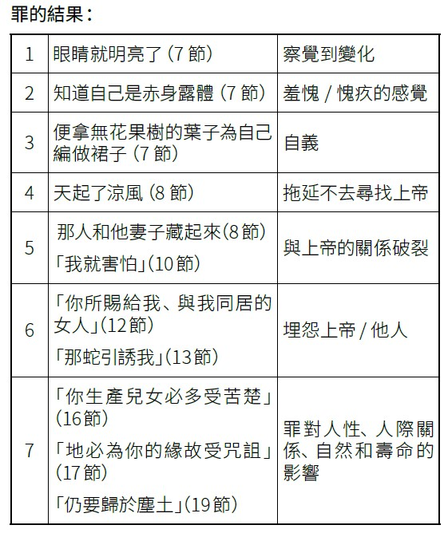

#### 深思

當撒但提議夏娃嘗嘗分別善惡樹上的果子時，夏娃要做出一項生死攸關的決定。在撒但一步步的引導下，她作出選擇，結果是痛苦的人生和最終的死亡。夏娃儘管是被虛假的承諾欺騙了，但她本可以離開撒但，在作出吃果子這一重大決策之前先與丈夫和上帝商量。懷愛倫特別強調了，當夏娃和蛇在樹下交談的時候，亞當並不在場。她指出天使曾經警告亞當和夏娃「在工作時不要彼此分開，因為他們可能遇見這個墮落的仇敵」（《早期著作》1882年，第148頁）。我們都清楚這不幸的結局，夏娃選擇吃下果子。只要朝着誘惑邁出一小步，就會產生幾乎無法抗拒的多米諾效應，最終陷入罪中。可悲的是，當夏娃將果子遞給亞當的時候，他選擇與妻子一同淪亡。仔細閱讀本周的經文，可以看到夏娃決定吃果子的具體步驟以及罪造成的後果。

撒但善於將犯罪前的經歷包裝得盡可能地令人愉悅、充滿誘惑。他對人類瞭如指掌，能夠根據每個人的個性和傾向量身定制引誘的方式。唯有避開誘惑者的領地，完全信靠上帝的話，才是唯一的安全之道。

`在看過你抄寫並註解的經文後，所標記的內容反映出什麼獨到的見解？`

`學完這一課，你發現了哪些問題？哪些部分是比較難以理解的？`

`你還發現了什麼其他的原則和結論？`

`你最難以抵擋的誘惑是什麼？在你的生活中，為了避免陷入誘惑，有哪些東西是應當完全摒棄或不再接觸的？`
