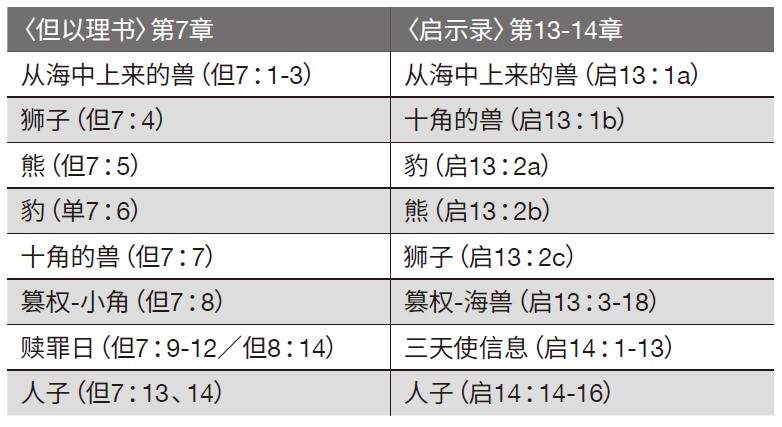

### 第一部分：概述

**存心节：耶9：24**
**学习重点：提后3：15-17**

有位神学院教授在每学期开始教授圣经课程时，都会问学生们一个简单却有挑战性的问题：“能帮助你理解《圣经》的，最重要的工具是什么？”学生们给出了在他们看来最好的答案：“圣经词典”、“祷告”、“圣灵”、“圣经语言知识（希伯来文、希腊文）”、“圣经软体”等。在听完所有答案后，教授告诉他们，尽管这些工具确实非常有用，但他们忽略了一个除却祷告和圣灵之外、最重要的资源：时间。

毫无疑问，当我们研究《圣经》时，最重要的工具之一是时间，而这往往也是我们最缺乏的资源。一旦我们愿意投入时间来研究《圣经》，下一个需要思考的问题便是：我们如何研读《圣经》？也就是说，有哪些原则可以指导我们研究并理解这本独特的书？

**课程主题**
本周我们将探讨阅读圣经预言的十项原则。前五项原则专注于文本本身：保持开放心态来阅读（将其视为全新的经文）、仔细地阅读（将其视为重要的经文）、以审美的眼光阅读（将其视为美丽的经文）、以语境化的方式阅读（将其置于圣经背景中）、以互文的方式阅读（结合其他圣经经文来解读）。

接下来的五个原则是着重于我们对文本的回应，以确保我们在聆听上帝的话语：以属灵的态度阅读（将其视天启的经文）、以思考的方式阅读（将其视为难解的经文）、以集体的方式阅读（将其视为给群体的经文）、以带来改变的方式阅读（将其与我们的生活结合）、以伦理的意识阅读（作出负责任的解读）。

### 第二部分：注释

**专注于文本**
任何关于圣经预言的讨论都要以圣经经文为基础。因此，读者首先要以探索的心来阅读圣经预言的相关经文。

*1. 保持开放的心态阅读。*将经文视为全新的、你尚不了解的内容。值得注意的是，但以理也是在承认自己不明白预言之后（参见但8：27：“无人能明白其中的意思”），才逐渐开始理解的（参见但9：2）。《圣经》告诉我们，人本就处在“黑暗”（约1：5）当中。事实上，当我们研究圣经预言时，最常见的诱惑就是还没有读到经文之前，就认定自己已经理解了其中的含义。这样一来，我们往往是将自己的想法强加于经文之上（牵强附会），而不是让经文自己说话（释经）。当我们凭自己的推断或是从当代事件的角度来解读预言时，就会出现这种状况。

*2. 仔细地阅读。*圣经预言包含了关乎世界命运和救赎之重要信息和真理（提后3：15-17）。先知们精选措辞和表达方式，来准确传递上帝赐给他们的异象。因此，我们应当慢慢地阅读经文，留心其中的每一个字。最好多读几遍，确保没有遗漏任何细节。怀爱伦在《教育论》一书中写道：“我们……就会在一般粗心的读者所视为荒漠的地方，发现生命之泉涌流。”（原文第191页）与其满足于对经文肤浅错误的理解，不如坦率地承认自己并不明白。

*3. 以审美的眼光阅读。*经文所采取的文学形式（如结构、平行关系）有助于解读预言中的信息。例如，〈但以理书〉第2章的异象与第7章的四兽异象呼应。〈但以理书〉与〈启示录〉中的预言也存在平行关系。〈启示录〉第13至14章中的末世异象在许多方面都与〈但以理书〉第7章中的异象相似，而后者的预言又与〈但以理书〉第8章中的预言相似。以下是对比图：

上述平行关系表明，〈但以理书〉第7章和第8章中的天上审判日／赎罪日与〈启示录〉第14章中的三天使信息是对应的，且同时进行。

*4. 以语境化的方式阅读。*考虑到先知所处的历史背景，但以理用北方巴比伦军队和南方埃及军队在迦基米施的交战（对比但1：1和耶46：2），来作为第11章中预言北方王与南方王之间的末世战争之模版。从文学背景来看，〈但以理书〉第7章用的是当时的通用语言亚兰文，而第8章用的则是以色列的希伯来文，这表明第7章的预言侧重于地上的列国，具有普世性影响，而第8章的预言则专注于上帝的子民，具有属灵方面的影响。

*5. 以互文的方式阅读。*鉴于最好的解释者就是预言经文本身，因此，从文本本身来寻找其含义是极有必要的。这一方法基于怀爱伦回应改教家马丁路德所提出的一项基本原则：“以圣经解释圣经，以一段经文为解开另一段经文的钥匙。”（《布道论》，原文第581页）。例如，〈但以理书〉第8章中公绵羊与公山羊的异象，以及它与〈利未记〉16章之间有许多语言上的联，都表明〈但以理书〉8章的预言指向赎罪日。

**专注于个人的回应**
对预言的研究成果在很大程度上取决于研究者的心态。

*1. 以属灵的态度阅读。*《圣经》是上帝所默示的，因此，为了完全且正确地理解某段经文，属灵的因素必须参与其中。因为这样的事情“唯有属灵的人才能看透”（林前2：14）。这说明在实践中，信心和祷告是成功释经的重要因素。祷告能为研经的人带来上帝的帮助。相信上帝启示了《圣经》中的预言，并且相信预言终究会实现，这会使人有能力看到预言的应验，而其他人可能什么都看不到。

*2. 以思考的方式阅读。*理解天启的经文需要我们勤奋刻苦地努力。〈传道书〉称这种努力为“上帝叫世人所经练的是极重的劳苦”（传1：13）。在〈但以理书〉中，“明白”一词是关键字（出现了15次），因为“夸口的却因他有聪明，认识我的耶和华”（耶9：24）。换言之，认识上帝是智慧的终极目标。

*3. 以集体的方式阅读。*《圣经》中的预言是透过上帝子民的群体见证传递给我们的，同样，它也是为上帝子民的社群所预备的。虽然研究上帝的话语离不开个人创造性的贡献，但也离不开其他弟兄姐妹的智慧。上帝通常是将祂的子民作为一个敬拜的群体而向他们说话的：“以色列啊，你要听！”（申6：4）但以理预言，到了末世的时候，“有许多人”，即上帝的子民，是“智慧人”，他们“能明白”（但12：10）。

*4. 以带来改变的方式阅读。*除非《圣经》能改变我们并影响我们的生活，否则我们就无法真正理解它。为了说明这一点，我们可以读一读某位欧洲观光客在非洲的故事 。这位观光客嘲笑他正在读《圣经》的非洲仆人，说：“你为什么读《圣经》？”他接着说：“这不过是一连串故事而已。”这时，非洲仆人回答道：“若不是我读过《圣经》，你早就成了我的盘中餐了。”这个故事包含了一个重要原则，即上帝的话语具有强大的力量，它被比作“两刃的剑”（来4：12）。因此，上帝的预言不仅能毫不费力地刺透仇敌和压迫者的罪恶，也会以说话或见证来“反对”我们（耶28：8）。

*5. 以伦理的意识阅读。*遗憾的是，《圣经》的预言常被用来支持人类的罪恶。宣扬白人优于黑人，且为种族隔离和奴隶制辩护的种族主义理论得以建立，就是因为曲解了创9：25的预言。促成大屠杀和十字军东征，并在六百万犹太人被杀事件中扮演重要角色的反犹太主义，正是在误读圣经预言（但9：24）的基础上发展起来的。纵观历史，在家里对妇女实施虐待和犯罪往往以创3：16的预言为辩护依据。在我们学习上帝的预言时，请允许上帝所启示的经文完全掌控我们的心思意念，好接受公义的教训（参见提后3：16）。

### 第三部分：应用

根据提后3：15-17，运用本周所学知识回答下列问题。

**专注于文本**
`1. 提后3：15-17的关键字是什么?`

`2. 讨论并思考以下词语的重要性：“圣经”、“智慧”、“赐予”、“完全”。`

`3. 为什么研究《圣经》能激发创造性思维？`

`4. 这段经文的结构是什么？`

`5. 这段经文的背景是什么？`

`6. 找出另外两段具有相同主题的经文。`

`例如诗119：97-104和约5：39。找出这些经文的相似之处，对其主题进行比较和对比。它们有何相似或不同之处？`

**专注于个人的回应**
`1. 提后3：15-17中的哪些词语说明了以敬虔态度研究《圣经》的重要性和必要性？例如，请对下列词语进行反思并讨论：“圣经”（暗示要以属灵的方式来研究），“赐予”（是上帝的礼物），“默示”（是圣灵的工作）`

`2. 经文中哪些词语表明要以思考的方式来读经？例如，请对下列词语进行反思并讨论：“明白”（认知功能；需要学习的资讯），“智慧”（思考的操练），“教导”（接受指引和学习新功课的能力）。`

`3. 经文中哪些词语表明要以集体的方式阅读？例如，请对下列词语进行反思并讨论：“从小”（父母的参与），“归正”（父母和老师的参与），“善事”（为有需要的人做的事）。`

`4. 经文中哪些词语表明要将所学的教训应用于个人生活当中？例如，请对下列词语进行反思并讨论：“使你有智慧”（提高个人的判断力和分辨力）。哪些词语表明要有道德的敏感度。例如，请对下列词语进行反思并讨论：“学义”（发展分辨正误的能力）。`
