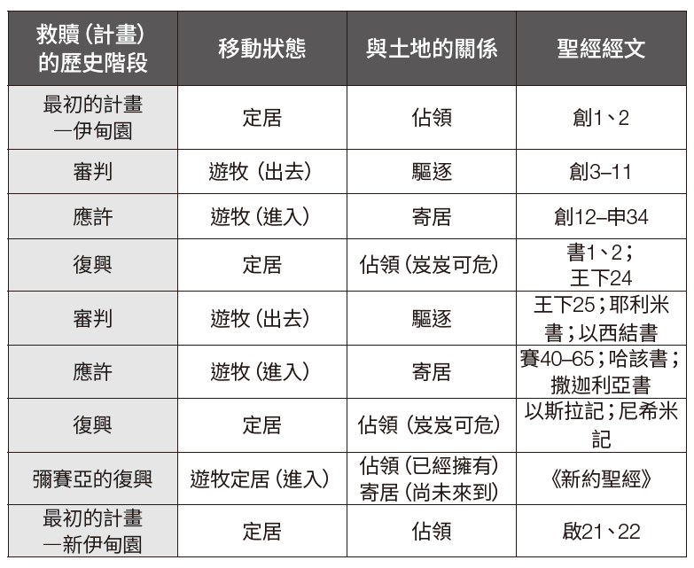

### 第一部分：概述
**關鍵經文：亞9：12**
**研究重點：創3：17–24；申6：3；書13：1–7；來12：28；利25：1–5，8–13；結37：14，25**

從開始到結束，聖經一直強調上帝的百姓和土地之間的聯繫。在聖經裡，土地是學習最初事物（原初論）和最終事物（末世論）的重要主題。在本週的學課，我們會從征服的角度考察這片土地的神學層面。 在約書亞記的中間部份，在描述了最初對土地的接管之後，作者講述了十二個支派間的土地分配。雖然一些讀者可能會覺得閱讀大量地理細節是枯燥乏味的，但它們對於傳達本卷書的信息至關重要，它們展示了上帝如何信守對以色列先祖們的應許。

在這種情況下，這片土地是一個字面意義上與實際的實體，是以色列可以書寫新篇章的地方。然而，隨著救贖故事的展開，這片土地預表性的特點變得更加明顯。數百年後，以色列自己將面臨被驅逐的處境，而回歸的希望在巴比倫被擄時期被點燃。猶大國確實回到了那地，但沒有得到永遠的安息。這樣的安息只能在彌賽亞的成就中找到。目前在耶穌裡得著的屬靈安息並沒有取消尚在未來的真正回歸，那時上帝的子民將再次擁有這片土地。在耶穌裡，目前屬靈安息的現實並不否定會在未來真正回歸那地。與此同時，我們像流浪者一樣遠離真正的家園，踏上前往我們真正應（居住的）土地的旅程，這片土地不是由地理界限定義的，而是由上帝在祂的子民中居住來定義的。

### 第二部分：註釋

**土地神學：在創造與新創造之間**
以下圖表總結了從創世記到啟示錄的土地聖經神學

在上帝最初的計畫中，祂設計要讓人類統治地球（創1：28）並住在一個名為伊甸園的永久快樂之地（創2：8），亞當和夏娃可以在那裡享受與上帝的直接交流（創3：8）。在這種定居的狀態下，他們將享受永生，條件是他們對造物主的忠誠。然而，罪打亂了這個最初的計畫，導致了人類歷史上的第一次流離失所。在審判之下，亞當和夏娃經歷了驅逐，離開了伊甸園（創3：23、24）。從神學的角度來看，從上帝指定的地方離開標誌了不順服的後果。從這層意義上，第一個家庭也成了第一批屬靈難民，他們過著遊牧的生活，並等待回歸。

回歸伊甸園的第一個可能跡象出現在亞伯拉罕的呼召中，上帝在呼召中命令他：「你要離開本地……往我所要指示你的地去。」（創12：1）在救贖的歷史中，只有當人們認識到亞伯拉罕的呼召標誌著從審判到應許的轉變時，我們才能體會到它的重要性。雖然亞伯拉罕的家人有好幾個世紀一直以遊牧為主，但他的順服開啟了通往應許之地的旅程。一路上，亞伯拉罕經歷了一段流放的時期，暫時離開了這片土地，後來又回來了（創12：10–20；20：1–17）。同樣，他的後代也經歷了離開和回歸的循環，例如他們成為埃及的流浪者，後來成為奴隸，直到上帝為他們插手干預（出6：5）。雅克・杜肯（Jacques Doukhan）恰當地概括了這些遊牧旅程的神學意義：「透過這些後裔家族的遊牧之旅，他們永遠無法到達，永遠無法滿足，總是渴望回家，創世記隨著希望的脈搏跳動。雖然他們嚐到了主恩的滋味，也就是上帝忠實履行其應許的記號，亞當、挪亞和先祖們繼續等待上帝最終戰勝邪惡和死亡。因為只有這樣，他們和我們，還有全部的受造物，才能回到伊甸園。」――杜肯，〈創世記〉，《復臨教會國際聖經註釋》（愛達荷州南帕：太平洋出版社，2016年），原文第37頁。

亞伯拉罕子孫們四百年的寄居之旅以四十年的曠野旅程結束，摩西在申命記中的最後演說預備了以色列從應許走向復興；從遊牧走向定居。從神學的角度，約書亞帶領以色列回歸上帝的土地。這個回歸並不意味著迦南地是伊甸園的實際位置。決定上帝地界的不是地理邊界，而是透過祂在其中的同在來決定（出25：8；33：14）。

因此，約書亞記也標誌著救贖歷史上一個重要的轉折，當時上帝的百姓要征服那地，享受安息。不幸的是，在短短一代人之內，以色列人開始過著不順服的生活，他們對這片土地的控制變得脆弱（書2：10–13）。從士師記時期直到列王紀下，以色列大部分時間都在努力維持著對這片土地的控制。在這段時期即將結束時，上帝派遣先知來警告祂的子民，由於違反了聖約，審判即將來臨，但他們沒有聽從（耶7：23–27）。在審判之下，以色列和猶大被趕出上帝計畫要賜給他們的地方（王下17：7–40；25：1–26）。在流放期間，他們再次成為漂流的客旅，離開了這片土地，走向了與亞伯拉罕相反的方向（詩137）。

然而，他們被流放的時間並沒有超過70年（耶25：11、12）。在先知書中，回歸的應許與不變的審判信息關係密切。這種回歸相當於新的創造（賽65：17），且帶有伊甸園的色彩（賽51：3；結36：35）。以斯拉和尼希米這兩個類似摩西般的人物，帶領了上帝的子民再次回到迦南地，並帶著上帝會祝福他們為恢復耶路撒冷所做的努力的應許。上帝的子民從巴比倫（現為波斯的一個省）出發，啟程前往那地（拉1；尼2）。儘管曾經遭到強烈反對（拉4），人們最終成功重建耶路撒冷（尼11、12）。然而，在整個過程中，以斯拉和尼希米需要對抗以色列人背道的叛教現象（拉10；尼13）。儘管有早期的復興和屬靈改革，但土地的所有權再次變得不確定，回歸的猶太人在兩約之間的時期，不時地面臨著外國勢力的壓迫。

隨著彌賽亞的到來，光明再次照耀。《新約聖經》的第一節經文表明，耶穌代表人類的新開始（太1：1）。耶穌要在亞當失敗之處得勝。基督拒絕了魔鬼給祂世上萬國的提議，這並不表示耶穌不會征服這些王國，只是表明祂會以上帝的方式征服他們（太4：8–10）。作為新的亞當，祂成為所有國度永不消亡的統治者（林前15：22–26）。土地概念的普世性在耶穌創立的上帝國度概念中得到了明顯的體現。這一理念並非對舊約的土地概念進行寓意解經或全新的詮釋。事實上，它與亞伯拉罕之約的普世性相互呼應，而這種普世性在原始的脈絡中就已顯明（創12：3；17：6、16）。新約所做的乃是闡明這些應許會在何時以及如何實現。

耶穌建立上帝國度的過程帶來了一種在舊約中並不常見的緊張關係。雖然基督帶來了最終的恢復，但祂的子民仍在漂流。從某種意義上說，祂的子民已經是祂國度的一部分，因為上帝「他又叫我們與基督耶穌一同復活，一同坐在天上」（弗2：6）。然而，祂的門徒們仍然是一個不屬於他們世界的遊牧民族（約17：11–19），等待著應許的圓滿實現。

上帝的子民朝向真正安息之所的遊牧經驗將在新耶路撒冷告終──聖經清楚地指出了這一點，不僅是按照出埃及的故事回到應許之地，也是回到伊甸園。生命之河流經城市中心，不只是以〈出埃及記〉的故事為藍本回到應許之地，也是回到伊甸園。生命之河流經城市中心，澆灌著萬國都可以吃的生命樹。就像在伊甸園未墮落之前一樣，沒有罪和死亡的咒詛，上帝再次與祂的子民同在（啟22：1–5）。救贖的故事由此回到了起點。十字架在一切的中心矗立，彌賽亞在那裡用自己的寶血確保了回歸的門票。新的亞當將帶領祂的難民兒女回家。哦，那將是多麼榮耀的一天啊！

### 第三部分：應用

**土地和盼望**
在聖經的背景下，土地和盼望有著內在的聯繫。這種聯繫在亞9：12裡顯而易見，在這段經文上帝邀請「被囚而有指望的人」轉回。這些人在漫長的流亡歲月裡一直在等待這個呼召，他們回到耶路撒冷的時候終於到了。

`1.	「盼望的囚徒」的畫面對你個人傳達了何種信息？`
`2.	你發現猶太人被擄至巴比倫的經歷和你的屬靈經歷之間有什麼相似之處，特別是在耶穌即將再來的背景下？`

**信、望、愛**
聖奧古斯丁（Augustine of Hippo）曾說：「沒有盼望就沒有愛，沒有愛就沒有盼望，而沒有信心，就沒有愛，也沒有盼望。」――聖奧古斯丁，《信仰、盼望與愛的論文》（華盛頓特區：閘道，1996年），原文第9頁。

這三個元素也一起出現在班傑明・蓋瑟（Benjamin Gaither）、傑夫・西爾維（Jeff Silvey）和金・威廉斯（Kim Williams）共同創作的歌曲中：

「我是盼望的囚徒，被我的信心所束縛，
被你的愛所束縛，被恩典鎖住
我可以自由離開，但我永遠不會離開
我奇妙地，心甘情願，自由地成為盼望的囚徒。」
――蓋瑟聲樂團（The Gaither Vocal Band），《盼望的囚徒》，2008年。

在你的屬靈旅程中，你以何種方式看待盼望、愛和信心之間的關係？

**像難民一樣生活**
根據聯合國難民署，全世界大約有4千4百萬的難民。他們當中的大多數人由於暴力、政治動亂和戰爭而被迫逃離自己的國家。在舊約律法中，以色列人在埃及作為客旅的經歷應該要影響以色列人對待那些住在他們當中的寄居者的方式（出23：9）。

你自己作為屬靈客旅的經歷應如何影響你今天對待難民的方式？