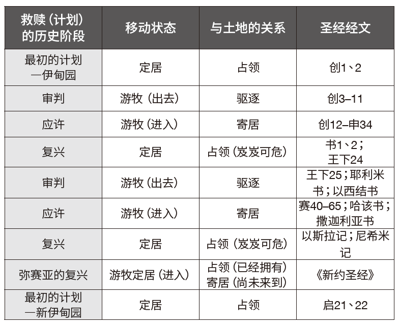

### 第一部分：概述
**關键经文：亚9：12**
**研究重点：创3：17–24；申6：3；书13：1–7；来12：28；利25：1–5，8–13；结37：14，25**

从开始到结束，圣经一直强调上帝的百姓和土地之间的联系。在圣经里，土地是学习最初事物（原初论）和最终事物（末世论）的重要主题。在本周的学课，我们会从征服的角度考察这片土地的神学层面。 在约书亚记的中间部分，在描述了最初对土地的接管之后，作者讲述了十二个支派间的土地分配。虽然一些读者可能会觉得阅读大量地理细节是枯燥乏味的，但它们对于传达本卷书的信息至关重要，它们展示了上帝如何信守对以色列先祖们的应许。

在这种情况下，这片土地是一个字面意义上与实际的实体，是以色列可以书写新篇章的地方。然而，随着救赎故事的展开，这片土地预表性的特点变得更加明显。数百年后，以色列自己将面临被驱逐的处境，而回归的希望在巴比伦被掳时期被点燃。犹大国确实回到了那地，但没有得到永远的安息。这样的安息只能在弥赛亚的成就中找到。目前在耶稣里得着的属灵安息并没有取消尚在未来的真正回归，那时上帝的子民将再次拥有这片土地。在耶稣里，目前属灵安息的现实并不否定会在未来真正回归那地。与此同时，我们像流浪者一样远离真正的家园，踏上前往我们真正应（居住的）土地的旅程，这片土地不是由地理界限定义的，而是由上帝在祂的子民中居住来定义的。

### 第二部分：注释

**土地神学：在创造与新创造之间**
以下图表总结了从创世记到启示录的土地圣经神学

在上帝最初的计划中，祂设计要让人类统治地球（创1：28）并住在一个名为伊甸园的永久快乐之地（创2：8），亚当和夏娃可以在那里享受与上帝的直接交流（创3：8）。在这种定居的状态下，他们将享受永生，条件
是他们对造物主的忠诚。然而，罪打乱了这个最初的计划，导致了人类历史上的第一次流离失所。在审判之下，亚当和夏娃经历了驱逐，离开了伊甸园（创3：23、24）。从神学的角度来看，从上帝指定的地方离开
标志了不顺服的后果。从这层意义上，第一个家庭也成了第一批属灵难民，他们过着游牧的生活，并等待回归。

回归伊甸园的第一个可能迹象出现在亚伯拉罕的呼召中，上帝在呼召中命令他：“你要离开本地……往我所要指示你的地去。”（创12：1）在救赎的历史中，只有当人们认识到亚伯拉罕的呼召标志着从审判到应许的转变时，我们才能体会到它的重要性。虽然亚伯拉罕的家人有好几个世纪一直以游牧为主，但他的顺服开启了通往应许之地的旅程。一路上，亚伯拉罕经历了一段流放的时期，暂时离开了这片土地，后来又回来了（创12：10–20；20：1–17）。同样，他的后代也经历了离开和回归的循环，例如他们成为埃及的流浪者，后来成为奴隶，直到上帝为他们插手干预（出6：5）。雅克・杜肯（Jacques Doukhan）恰当地概括了这些游牧旅程的神学意义：“透过这些后裔家族的游牧之旅，他们永远无法到达，永远无法满足，总是渴望回家，创世记随着希望的脉搏跳动。虽然他们尝到了主恩的滋味，也就是上帝忠实履行其应许的记号，亚当、挪亚和先祖们继续等待上帝最终战胜邪恶和死亡。因为只有这样，他们和我们，还有全部的受造物，才能回到伊甸园。”――杜肯，〈创世记〉，《复临教会国际圣经注释》（爱达荷州南帕：太平洋出版社，2016年），原文第37页。

亚伯拉罕子孙们四百年的寄居之旅以四十年的旷野旅程结束，摩西在申命记中的最后演说预备了以色列从应许走向复兴；从游牧走向定居。从神学的角度，约书亚带领以色列回归上帝的土地。这个回归并不意味着迦南地是伊甸园的实际位置。决定上帝地界的不是地理边界，而是透过祂在其中的同在来决定（出25：8；33：14）。

因此，约书亚记也标志着救赎历史上一个重要的转折，当时上帝的百姓要征服那地，享受安息。不幸的是，在短短一代人之内，以色列人开始过着不顺服的生活，他们对这片土地的控制变得脆弱（书2：10–13）。从士师记时期直到列王纪下，以色列大部分时间都在努力维持着对这片土地的控制。在这段时期即将结束时，上帝派遣先知来警告祂的子民，由于违反了圣约，审判即将来临，但他们没有听从（耶7：23–27）。在审判之下，以色列和犹大被赶出上帝计划要赐给他们的地方（王下17：7–40；25：1–26）。在流放期间，他们再次成为漂流的客旅，离开了这片土地，走向了与亚伯拉罕相反的方向（诗137）。

然而，他们被流放的时间并没有超过70年（耶25：11、12）。在先知书中，回归的应许与不变的审判信息关系密切。这种回归相当于新的创造（赛65：17），且带有伊甸园的色彩（赛51：3；结36：35）。以斯拉和尼希米这两个类似摩西般的人物，带领了上帝的子民再次回到迦南地，并带着上帝会祝福他们为恢复耶路撒冷所做的努力的应许。上帝的子民从巴比伦（现为波斯的一个省）出发，启程前往那地（拉1；尼2）。尽管曾经遭到强烈反对（拉4），人们最终成功重建耶路撒冷（尼11、12）。然而，在整个过程中，以斯拉和尼希米需要对抗以色列人背道的叛教现象（拉10；尼13）。尽管有早期的复兴和属灵改革，但土地的所有权再次变得不确定，回归的犹太人在两约之间的时期，不时地面临着外国势力的压迫。

随着弥赛亚的到来，光明再次照耀。《新约圣经》的第一节经文表明，耶稣代表人类的新开始（太1：1）。耶稣要在亚当失败之处得胜。基督拒绝了魔鬼给祂世上万国的提议，这并不表示耶稣不会征服这些王国，只是表明祂会以上帝的方式征服他们（太4：8–10）。作为新的亚当，祂成为所有国度永不消亡的统治者（林前15：22–26）。土地概念的普世性在耶稣创立的上帝国度概念中得到了明显的体现。这一理念并非对旧约的土地概念进行寓意解经或全新的诠释。事实上，它与亚伯拉罕之约的普世性相互呼应，而这种普世性在原始的脉络中就已显明（创12：3；17：6、16）。新约所做的乃是阐明这些应许会在何时以及如何实现。

耶稣建立上帝国度的过程带来了一种在旧约中并不常见的紧张关系。虽然基督带来了最终的恢复，但祂的子民仍在漂流。从某种意义上说，祂的子民已经是祂国度的一部分，因为上帝“他又叫我们与基督耶稣一同复活，一同坐在天上”（弗2：6）。然而，祂的门徒们仍然是一个不属于他们世界的游牧民族（约17：11–19），等待着应许的圆满实现。

上帝的子民朝向真正安息之所的游牧经验将在新耶路撒冷告终──圣经清楚地指出了这一点，不仅是按照出埃及的故事回到应许之地，也是回到伊甸园。生命之河流经城市中心，不只是以〈出埃及记〉的故事为蓝本回到应许之地，也是回到伊甸园。生命之河流经城市中心，浇灌着万国都可以吃的生命树。就像在伊甸园未堕落之前一样，没有罪和死亡的咒诅，上帝再次与祂的子民同在（启22：1–5）。救赎的故事由此回到了起点。十字架在一切的中心矗立，弥赛亚在那里用自己的宝血确保了回归的门票。新的亚当将带领祂的难民儿女回家。哦，那将是多么荣耀的一天啊！

### 第三部分：应用

**土地和盼望**
在圣经的背景下，土地和盼望有着内在的联系。这种联系在亚9：12里显而易见，在这段经文上帝邀请“被囚而有指望的人”转回。这些人在漫长的流亡岁月里一直在等待这个呼召，他们回到耶路撒冷的时候终于到了。

`1.	“盼望的囚徒”的画面对你个人传达了何种信息？`
`2.	你发现犹太人被掳至巴比伦的经历和你的属灵经历之间有什么相似之处，特别是在耶稣即将再来的背景下？`

**信、望、爱**
圣奥古斯丁（Augustine of Hippo）曾说：“没有盼望就没有爱，没有爱就没有盼望，而没有信心，就没有爱，也没有盼望。”――圣奥古斯丁，《信仰、盼望与爱的论文》（华盛顿特区：闸道，1996年），原文第9页。

这三个元素也一起出现在班杰明・盖瑟（Benjamin Gaither）、杰夫・西尔维（Jeff Silvey）和金・威廉斯（Kim Williams）共同创作的歌曲中：

“我是盼望的囚徒，被我的信心所束缚，
被你的爱所束缚，被恩典锁住
我可以自由离开，但我永远不会离开
我奇妙地，心甘情愿，自由地成为盼望的囚徒。”
――盖瑟声乐团（The Gaither Vocal Band），《盼望的囚徒》，2008年。

在你的属灵旅程中，你以何种方式看待盼望、爱和信心之间的关系?

**像难民一样生活**
根据联合国难民署，全世界大约有4千4百万的难民。他们当中的大多数人由于暴力、政治动乱和战争而被迫逃离自己的国家。在旧约律法中，以色列人在埃及作为客旅的经历应该要影响以色列人对待那些住在他们当中的寄居者的方式（出23：9）。

你自己作为属灵客旅的经历应如何影响你今天对待难民的方式？