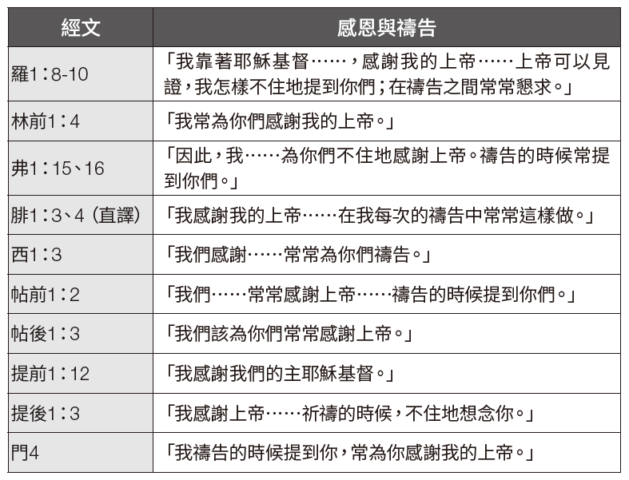

### 第一部份：概述

**存心節：腓1：6**
**學習重點：腓1：1-18；弗5：18-21；西1：4-8**

作者唐．卡森（D．A．Carson）對當今基督教會最迫切的需要進行推測，他猜想人們可能會給出不同的答案。卡森列舉了許多層面；例如：性純潔、財務誠信與慷慨、佈道、植堂、屬靈思維，以及真正的群體敬拜經驗。他最後總結說：「從某種意義上說，這些迫切的需要只是更嚴重之缺乏的表象。西方基督教界最迫切的需要，就是更深入地認識神。我們需要更了解上帝……而認識上帝的一個基本步驟，以及證明我們確實認識上帝的一個基本表現，就是禱告——屬靈的、恆切的、合乎聖經教導的禱告。」──唐．卡森，《屬靈改革的呼召：保羅及其禱告的優先次序》（密西根州急流城：貝克出版社，1992年），原文第15、16頁。

保羅一貫強調基督徒的屬靈操練，例如禱告和感恩。感恩不僅是他禱告的重要組成部分，也是他書信中常見的內容。他不僅透過不斷地祈禱向上帝表達感激之情，也鼓勵他的聽眾這樣做（西3：17；帖前5：18）。他認為感恩是上帝在一個人心中作工所結的果子（腓1：6，10、11）。

本週課程強調兩個重要主題：
1. 感恩與禱告本質上緊密相連，就像一枚硬幣的兩面。
2. 感恩與禱告（以及其他表現）是上帝在我們裡面做美善之工的具體表現。

### 第二部份：註釋

**例證**
心理學家羅伯特．A．埃蒙斯（Robert A. Emmons）曾引用梅斯特．艾克哈特（Meister Eckhart）十分美好的一句名言：「若你一生中唯一的禱告，就是一句『謝謝』，那也足夠了！」當時，埃蒙斯分享了一位患有後小兒麻痺症候群之婦女的故事，來完美呈現出感恩禱告與有意義的生命之間的關係。她在寫給埃蒙斯的信中說：

「讓我最感恩的經歷之一，就是我第一個孩子出生的時候。在我不斷成長的過程中，我一直在想自己能否生孩子，能否用僅剩的一隻手臂來照顧孩子，上帝是否願意以這樣的方式賜福我。在我的女兒出世後，所有的護士都懷疑我能否照顧好她。然而我意識到，上帝既然選擇給我一個孩子，就一定會賜予我照顧她的力量。既然上帝沒有讓我免於小兒麻痺症，那麼我能有一個孩子就絕非偶然。所以，當她出生時，我讚美上帝，因為祂讓我的丈夫和我能分享培育一個新生命並讓她成為上帝祝福的喜樂……還有什麼比撫養另一個人更偉大的目的呢？沒有了，而這就是我感恩的喜樂——生命中的意義與目的帶來的喜樂。」埃蒙斯進一步指出：「有證據清楚地表明，無論在生活中還是在面對生活的態度上培養感恩的心，都能使我們成為更快樂、更健康的人。」──羅伯特．A．埃蒙斯，《感恩的力量：感恩科學如何讓你更快樂》（紐約：霍頓米夫林公司，2007年），原文第90，110，185頁。

**感恩與禱告本質上緊密相連**
保羅的書信中有一個習慣性的特徵──感恩段落，而它實際上就是禱告。下表可以清晰說明這一點：

觀察上表可以得出三個重要結論。第一，對於保羅來說，感恩就是一種祈禱，因為感恩與禱告始終交織在一起。第二，即便保羅在某些書信的感恩段落並沒有提到「禱告」這個詞，但他感謝的對象依然是上帝（帖後1：3；提前1：12）。第三，「不住地」、「常常」這些詞反覆出現，表明在保羅的生活中，禱告和感謝是持續不斷、甚至不可分割的。

值得注意的是，在感恩和祈禱的事上，保羅期望他的聽眾能夠效法他。在保羅看來，不敬虔的人有個明顯的特徵，就是不將榮耀和感謝歸給上帝（羅1：21）。他鼓勵羅馬的信徒們要感謝上帝（羅14：6）。當他請求哥林多教會為他和他的同工們禱告時，他是希望許多人為他們感謝上帝的恩典（林後1：11）。

在〈以弗所書〉第5章18-21中，保羅指出了被聖靈充滿之人的特徵。他們（1）「用詩章、頌詞、靈歌」相互啟迪；（2）生命中充滿對上帝的頌揚；「口唱心和地讚美主」；（3）「凡事要奉我們主耶穌基督的名常常感謝父上帝」；（4）而且「存敬畏基督的心，彼此順服」。這樣看來，感謝上帝與歌唱讚美祂一樣，都是敬拜的表現。

保羅在〈歌羅西書〉第3章17節中更進一步地說明，「無論做什麼，或說話或行事，都要奉主耶穌的名，藉著他感謝父上帝。」保羅也對帖撒羅尼迦人說同樣的話，「凡事謝恩。」（帖前5：18）保羅鼓勵他的聽眾要將感恩與祈禱融入自己的生活，也效法他個人對於感恩與祈禱的深刻投入。

**上帝在我們裡面的工作**
在保羅寫給腓立比教會的書信中，有一句堪稱金句：「我深信那在你們心裡動了善工的，必成全這工，直到耶穌基督的日子。」（腓1：6）有些讀者可能會傾向於將「善工」解讀得過於狹隘，認為它是指腓立比人對保羅的關心和愛戴，因為他們在保羅入獄期間不斷提供經濟支援。雖然他們對保羅的關心和福音的推進的確是上帝在他們心中動工的結果，但保羅在這裡所指的是更廣泛的概念，就是藉著基督得蒙救贖。

上帝是那位開始救贖善工的主，在基督復臨時，這工作也必圓滿結束。值得注意的是，這一概念在感恩段落中表述，說明感恩正是上帝在我們心中動工的證據。保羅在〈腓立比書〉第2章12、13節中說過類似的話：「就當恐懼戰兢做成你們得救的功夫。因為你們立志行事都是上帝在你們心裡運行，為要成就他的美意。」

至少可以說，保羅的建議──做成自己得救的功夫──很能引起人的興趣。我們該怎麼做呢？在〈希伯來書〉第12章2節中可以找到答案，其中講到耶穌「為我們的信心創始成終」。因此，保羅指出，我們應當「奔那擺在我們前頭的路程，仰望……耶穌」（來12：1、2）。但這並不是全部。我們也必須「放下各樣的重擔，脫去容易纏累我們的罪」（來12：1）。有的經文（例如腓1：6和來12：2）會提醒我們，救恩從根本上來說是上帝的工作，不是我們的。然而，我們仍被呼召去做成自己得救的功夫，或者換句話說，去「奔那擺在我們前頭的路程」，這就要有禱告的生活，尋求聖靈所賜的基督徒的美德（腓1：9-11；西1：4-8），並對上帝在我們裡面的工作心存感恩（腓1：3-6）。總而言之，我們應當「行事為人對得起主，凡事蒙他喜悅，在一切善事上結果子，漸漸地多知道上帝」（西1：10）。

### 第三部份：應用

默想下列主題。引導學生回答下列問題：

我們都喜歡好事發生在自己身上。無論是買車買房，還是經歷多年刻苦學習終於畢業，亦或是脫離險境，我們都要感謝上帝。這些人生重要的里程碑讓我們的心中充滿了喜悅和感激。然而，如果我們留心觀察周圍的一切，就會發現無數值得感恩的事。然而，沒有什麼比認識到上帝在我們身上的善行更能激發我們的感激之情了。懷愛倫說：「我們的思想需要擴展，好能理解上帝所作預備的意義。我們要反映上帝品德的最高特質。我們應當感激沒有被撇下獨自為人。」──《使我認識祂》，原文第302頁。

上帝期望我們在禱告中要有真誠的感恩之心。例如，在〈帖撒羅尼迦前書〉第5章17、18節中，在「不住地禱告」後面，緊接著的就是「凡事謝恩」。這意味著一方面我們總有感恩的理由，另一方面我們的禱告應該要常常表達對上帝的感激之情。值得注意的是，保羅的意思並不是「要因著每一件事謝恩」，而是說「要在一切狀況下感謝上帝」。上帝將祂的獨生子賜給我們，替我們而死，這就足以讓我們每天都心存感激，並以禱告中那讚美之言和生活中的善舉來表達我們的感恩。

*問題：*
`1. 你會因哪些屬靈的祝福而感謝上帝？又會因哪些在物質上和身體上的祝福而感謝祂？`
`2. 「因著每一件事謝恩」和「要在一切狀況下感謝上帝」究竟是什麼意思？二者之間的不同有何重要意義？`
`3. 懷愛倫所說的，我們「沒有被撇下獨自為人」，究竟什麼意思？我們為什麼要因此心懷感激？`