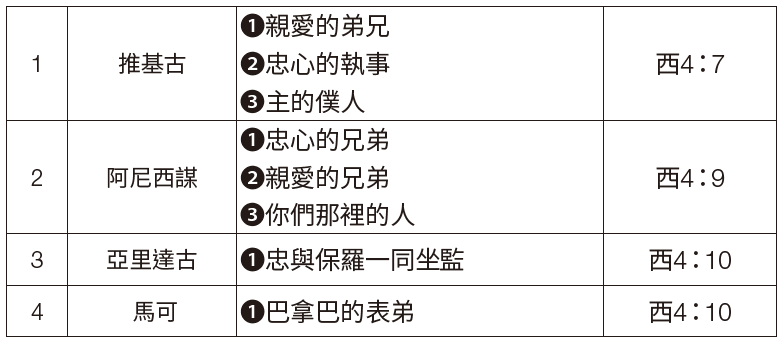
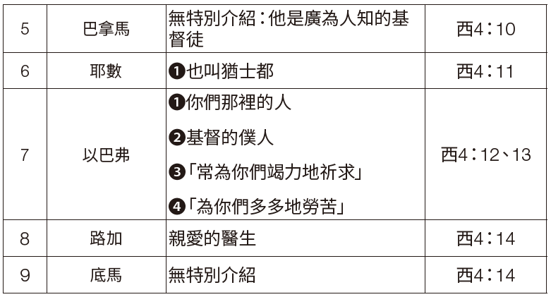

### 第一部份：概述

**存心節：帖前5：18**
**學習重點：西4：7–18**

保羅寫給歌羅西人的最後一番話中，飽含了對教會深切的愛與關懷。他稱推基古和阿尼西謀（編註：舊譯名阿尼西母，今依新標點和合本譯作阿尼西謀）為「親愛的弟兄」（西4：7，9），稱路加是「親愛的醫生」（西4：14）。保羅的心因愛而洋溢。他對同工的愛，正是他對教會之愛的寫照。他對信眾的愛與關懷表明，他渴望知道他們的情況並安慰他們（西4：8）。

保羅對歌羅西信徒的心願是他們能「在上帝一切的旨意上得以完全，信心充足，站立得穩」（西4：12）。因此，他組建了一支「夢幻團隊」來與他同工。事實上，〈歌羅西書〉第4章7-14節就像是一場閱兵，描繪出一群投身於最重要之屬靈爭戰的勇敢的基督精兵。保羅教導我們，傳道需要團隊合作。在服事歌羅西教會的過程中，推基古和阿尼西謀衝在最前線，他們是保羅派遣的代表，負責傳遞與收集消息（西4：7-9）。然而，保羅的其他同工也都深深牽掛著歌羅西信徒（西4：10-14）。

本週課程包含三個主題：
1. 佈道需要人們緊密合作、共同努力。
2. 因為佈道需要團隊協作，因此教會領袖和宣教士們必須懷抱著明確的目標工作，使教友們「得以完全，信心充足，站立得穩」（西4：12）。
3. 對耶穌深切的愛，可以將向世俗標準和物質主義妥協的可能性摒除。

### 第二部份：註釋

**傳道包含團隊工作**
耶穌十分強調團隊合作的重要性。例如，在〈路加福音〉第5章，我們看到耶穌在革尼撒勒湖邊，他「見有兩隻船灣在湖邊；打魚的人卻離開船洗網去了」（路5：1、2）。這些人因為什麼都捕不到，已經放棄了！耶穌吩咐他們再次撒網「打魚」（路5：4）。「他們下了網，就圈住許多魚，網險些裂開。」（路5：6）如此一來，這在船上的人便「招呼那只船上的同伴來幫助」（路5：7）。無論是對他們還是對我們，這是多麼令人印象深刻的一課啊！現在耶穌可以說：「從今以後，你要得人了。」（路5：10）

〈歌羅西書〉第4章7-14節體現出保羅對團隊合作的重視（另見林前3：5-9）。他在宣教工作上並不孤獨。在這一段經文中，保羅提到了一支由九人組成的宣教團隊！我們可以從他描述他們參與福音使命的方式上得到寶貴的啟示。

上表顯示出保羅有一支夢幻團隊。傳道工作不是一支獨舞，越多人參與到傳道工作中，成果就會越好。當然，隊伍中也會有幾乎無名的傳道者，例如「耶數又稱為猶士都」（西4：11）。整本新約聖經中唯一提到他的地方，就是這節經文。值得注意的是，保羅並沒有對底馬多做評論（西4：14）。或許保羅的沉默已經說明了問題，他對於底馬已經無話可說，也許底馬的信仰根基已經動搖，就像他在〈提摩太後書〉第4章10節中提到的那樣。另外，保羅的傳教隊伍中既有猶太人，也有外邦人。在信仰的合一中，人與人之間的差異消弭了。

另外還有一些值得注意的地方：

第一，推基古和阿尼西謀被稱為親愛的和忠心的。

第二，阿尼西謀和以巴弗都是「你們那裡的人」，說明他們本就是歌羅西教會的信徒。

第三，保羅接著說以巴弗是「作基督耶穌僕人的」，常常祈禱，對教會充滿熱忱。雖然他不在歌羅西，但他「常為你們竭力地祈求」，「多多地勞苦」（西4：12、13）。從他身上我們可以學到寶貴的一課：即使無法親自幫助，也可以藉著禱告伸出援手。

第四，其中有幾位在〈使徒行傳〉中出現過，是保羅佈道旅行的同工（亞里達古【徒19：29；20：4、5；27：2】；推基古【徒20：4】；巴拿巴【徒12：25；13：1–15；14：19–28】）。

第五，阿尼西謀是新歸信的信徒（門1：10），將他納入團隊說明保羅十分重視培養人們傳道，使他們成為自己的同工（西4：11）。

第六，起初，保羅不願意再給馬可第二次機會，因為他曾對傳道工作猶豫不決（徒15：38），但後來他重新考慮這件事（西4：10；提後4：11），甚至最終他稱馬可為同工（門1：24）。

第七，保羅充滿愛意的問候以及他代同工表達的致意，強化了教會領袖與會眾之間的情誼。

**充足與完全**
基督徒領袖的工作必須有一個明確的目標：幫助信徒在信仰上成長，與上帝的心意完全契合。他們要為信徒努力並祈禱，希望他們成為「完全，信心充足」（西4：12）的人。乍看之下，保羅似乎是在提倡無罪或絕對的完美，但事實並非如此。「充足」對應的希臘文是teleios ，最直接的含義是「成熟」（林前2：6；林前14：20；腓3：15）。而「完全」的希臘文plēroō用在人身上時，表示被上帝的屬靈祝福充滿（參見徒2：28；羅15：13）。保羅在〈以弗所書〉第4章13節指出，「在真道上同歸於一，認識上帝的兒子」會讓人「長大成人（成熟，teleios）」。

保羅希望歌羅西教會的信徒們能有像基督一樣的品格。在前面的信中，他已經表達過這種想法（西2：6、7）。基督化的生活方式包括「在一切屬靈的智慧悟性上，滿心知道上帝的旨意」（西1：9），行事為人「對得起主」，蒙祂喜悅，「在一切善事上結果子」，「漸漸地多知道上帝」（西1：10）。屬靈成熟的其餘特徵出現在〈歌羅西書〉第2章2節，保羅談到要「因愛心互相聯絡」，為要「豐豐足足在悟性中有充足的信心」。總的來說，保羅認為傳道的目標就是要「把個人在基督裡完完全全地引到上帝面前」（西1：28；另見1：29）。

**提防物質主義**
聖經教導基督徒，不要效法這世界的價值觀，更不要接受甚囂塵上的物質主義（羅12：2）。然而，底馬卻陷入了貪愛世界的陷阱之中（提後4：10）。在〈羅馬書〉第12章2節和〈提摩太後書〉第4章10節中，「世界」對應的希臘文都是aiōn，是指「與世俗社會相關的實踐與標準體系」。──約翰內斯．P．洛和尤金．阿爾伯特．尼達，《新約希臘文-英文詞典：語義域分類》，第2版，第1卷（紐約：聯合聖經公會，1996年），原文第507頁。

除了aiōn之外，kosmos也常用於指代這世界中邪惡的價值觀和運作體系。例如，使徒約翰曾用三句話來概括世俗體系運行的模式（參見約壹2：16）：「肉體的情慾、眼目的情慾，並今生的驕傲。」學者們一致認為，這三重世俗的慾望與驕傲構成了強烈的反物質主義的警告。無怪乎保羅對「今世」（多2：12）有著如此負面的看法，以至於要強調耶穌「為我們的罪捨己，要救我們脫離這罪惡的世代」。在〈提摩太前書〉第6章17節中，保羅囑咐「那些今世富足的人，不要自高，也不要倚靠無定的錢財；只要倚靠那厚賜百物給我們享受的上帝」。在〈提多書〉第2章12節中，使徒指出基督徒應當除去「不敬虔的心和世俗的情慾」，並在「今世」以「自守、公義、敬虔度日」。

值得注意的是，底馬對世界的貪愛，正好解釋了保羅所說的他「離棄我……去了」（提後4：10），表明他放棄了宣教的責任。當人貪愛世界時，一個明確的標誌就是內心對宣教的熱忱漸漸冷卻。那些對來世有著深切盼望的人，就會「自守、公義、敬虔度日」（多2：12）；這種盼望必然體現在積極參與宣教的事上。

### 第三部份：應用

默想下列主題。引導學生回答下列問題：

「保羅的信中充滿強烈的情感，言辭中反映出他強烈的群體意識，他渴望與信徒同在，與他們有美好的團契。保羅絕不是獨來獨往的人。他更像是一位思念遠方兒女的父親……在他的書信中，這種集體性的思維一次次顯現出來。對他個人來說，社交網路極其重要，同時也是傳播福音這一共同使命的關鍵工具。」──本．威瑟林頓三世（Ben Witherington III），《保羅探求：重尋大數的猶太人》（伊利諾州唐格洛夫：校際出版社，1998年），原文第114頁。

這段話揭示了保羅對於傳揚福音之使命的全然委身。生活在世界歷史末期的我們對於傳福音的投身程度，難道還比不上一世紀的保羅和他的宣教團隊嗎？他們盡心竭力、同心合作，為了拓展上帝的國度。我們也同樣受到呼召，要合一同行。在上帝的宇宙救贖計畫中每個人都有應當扮演的角色。我們蒙召要幫助他人在屬靈上成長，為來世做好準備。事實上，我們越是渴望那將要到來的世界，就會越在今世為主多多勞苦。我們對耶穌的愛也必保守我們，不向這世界的價值觀妥協，讓我們雖然在這世間生活，卻不屬於這世界（約15：19）。

*問題：*
`1. 為什麼我們的社交圈對於事工如此重要？在你的社交圈中有哪些人？在你的宣教工作和為上帝作見證的事上，他們是如何幫助你的？`
`2. 上帝如何呼召你幫助他人在屬靈生命上成長，並為天國做好準備？`
`3. 你對耶穌的愛如何幫助你免於向世俗價值觀妥協？在世卻不屬世究竟是什麼意思？`