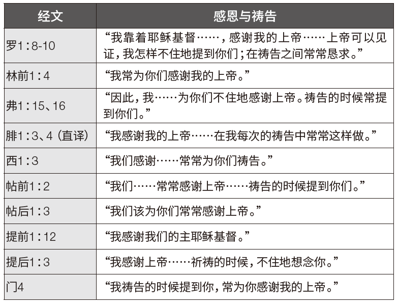

### 第一部份：概述

**存心节：腓1：6**
**学习重点：腓1：1-18；弗5：18-21；西1：4-8**

作者唐．卡森（D．A．Carson）对当今基督教会最迫切的需要进行推测，他猜想人们可能会给出不同的答案。卡森列举了许多层面；例如：性纯洁、财务诚信与慷慨、布道、植堂、属灵思维，以及真正的群体敬拜经验。他最后总结说：“从某种意义上说，这些迫切的需要只是更严重之缺乏的表象。西方基督教界最迫切的需要，就是更深入地认识神。我们需要更了解上帝……而认识上帝的一个基本步骤，以及证明我们确实认识上帝的一个基本表现，就是祷告⸺属灵的、恒切的、合乎圣经教导的祷告。”──唐．卡森，《属灵改革的呼召：保罗及其祷告的优先次序》（密西根州急流城：贝克出版社，1992年），原文第15、16页。

保罗一贯强调基督徒的属灵操练，例如祷告和感恩。感恩不仅是他祷告的重要组成部分，也是他书信中常见的内容。他不仅透过不断地祈祷向上帝表达感激之情，也鼓励他的听众这样做（西3：17；帖前5：18）。他认为感恩是上帝在一个人心中作工所结的果子（腓1：6，10、11）。

本周课程强调两个重要主题：
1. 感恩与祷告本质上紧密相连，就像一枚硬币的两面。。
2. 感恩与祷告（以及其他表现）是上帝在我们里面做美善之工的具体表现。

### 第二部份：注释

**例证**
心理学家罗伯特．A．埃蒙斯（Robert A. Emmons）曾引用梅斯特．艾克哈特（Meister Eckhart）十分美好的一句名言：“若你一生中唯一的祷告，就是一句‘谢谢’，那也足够了！”当时，埃蒙斯分享了一位患有后小儿麻痹症候群之妇女的故事，来完美呈现出感恩祷告与有意义的生命之间的关系。她在写给埃蒙斯的信中说：

“让我最感恩的经历之一，就是我第一个孩子出生的时候。在我不断成长的过程中，我一直在想自己能否生孩子，能否用仅剩的一只手臂来照顾孩子，上帝是否愿意以这样的方式赐福我。在我的女儿出世后，所有的护士都怀疑我能否照顾好她。然而我意识到，上帝既然选择给我一个孩子，就一定会赐予我照顾她的力量。既然上帝没有让我免于小儿麻痹症，那么我能有一个孩子就绝非偶然。所以，当她出生时，我赞美上帝，因为祂让我的丈夫和我能分享培育一个新生命，并让她成为上帝祝福的喜乐……还有什么比抚养另一个人更伟大的目的呢？没有了，而这就是我感恩的喜乐⸺生命中的意义与目的带来的喜乐。”埃蒙斯进一步指出：“有证据清楚地表明，无论在生活中还是在面对生活的态度上培养感恩的心，都能使我们成为更快乐、更健康的人。”──罗伯特．A．埃蒙斯，《感恩的力量：感恩科学如何让你更快乐》（纽约：霍顿米夫林公司，2007年），原文第90，110，185页。

**感恩与祷告本质上紧密相连**
保罗的书信中有一个习惯性的特征──感恩段落，而它实际上就是祷告。下表可以清晰说明这一点：

观察上表可以得出三个重要结论。第一，对于保罗来说，感恩就是一种祈祷，因为感恩与祷告始终交织在一起。第二，即便保罗在某些书信的感恩段落并没有提到“祷告”这个词，但他感谢的对象依然是上帝（帖后1：3；提前1：12）。第三，“不住地”、“常常”这些词反复出现，表明在保罗的生活中，祷告和感谢是持续不断、甚至不可分割的。

值得注意的是，在感恩和祈祷的事上，保罗期望他的听众能够效法他。在保罗看来，不敬虔的人有个明显的特征，就是不将荣耀和感谢归给上帝（罗1：21）。他鼓励罗马的信徒们要感谢上帝（罗14：6）。当他请求哥林多教会为他和他的同工们祷告时，他是希望许多人为他们感谢上帝的恩典（林后1：11）。

在〈以弗所书〉第5章18-21中，保罗指出了被圣灵充满之人的特征。他们（1）“用诗章、颂词、灵歌”相互启迪；（2）生命中充满对上帝的颂扬；“口唱心和地赞美主”；（3）“凡事要奉我们主耶稣基督的名常常感谢父上帝”；（4）而且“存敬畏基督的心，彼此顺服”。这样看来，感谢上帝与歌唱赞美祂一样，都是敬拜的表现。

保罗在〈歌罗西书〉第3章17节中更进一步地说明，“无论做什么，或说话或行事，都要奉主耶稣的名，借着他感谢父上帝。”保罗也对帖撒罗尼迦人说同样的话，“凡事谢恩。”（帖前5：18）保罗鼓励他的听众要将感恩与祈祷融入自己的生活，也效法他个人对于感恩与祈祷的深刻投入。

**上帝在我们里面的工作**
在保罗写给腓立比教会的书信中，有一句堪称金句：“我深信那在你们心里动了善工的，必成全这工，直到耶稣基督的日子。”（腓1：6）有些读者可能会倾向于将“善工”解读得过于狭隘，认为它是指腓立比人对保罗的关心和爱戴，因为他们在保罗入狱期间不断提供经济支援。虽然他们对保罗的关心和福音的推进的确是上帝在他们心中动工的结果，但保罗在这里所指的是更广泛的概念，就是借着基督得蒙救赎。

上帝是那位开始救赎善工的主，在基督复临时，这工作也必圆满结束。值得注意的是，这一概念在感恩段落中表述，说明感恩正是上帝在我们心中动工的证据。保罗在〈腓立比书〉第2章12、13节中说过类似的话：“就当恐惧战兢做成你们得救的功夫。因为你们立志行事都是上帝在你们心里运行，为要成就祂的美意。”

至少可以说，保罗的建议──做成自己得救的功夫──很能引起人的兴趣。我们该怎么做呢？在〈希伯来书〉第12章2节中可以找到答案，其中讲到耶稣“为我们的信心创始成终”。因此，保罗指出，我们应当“奔那摆在我们前头的路程，仰望……耶稣”（来12：1、2）。但这并不是全部。我们也必须“放下各样的重担，脱去容易缠累我们的罪”（来12：1）。有的经文（例如腓1：6和来12：2）会提醒我们，救恩从根本上来说是上帝的工作，不是我们的。然而，我们仍被呼召去做成自己得救的功夫，或者换句话说，去“奔那摆在我们前头的路程”，这就要有祷告的生活，寻求圣灵所赐的基督徒的美德（腓1：9-11；西1：4-8），并对上帝在我们里面的工作心存感恩（腓1：3-6）。总而言之，我们应当“行事为人对得起主，凡事蒙他喜悦，在一切善事上结果子，渐渐地多知道上帝”（西1：10）。

### 第三部份：应用

默想下列主题。引导学生回答下列问题：

我们都喜欢好事发生在自己身上。无论是买车买房，还是经历多年刻苦学习终于毕业，亦或是脱离险境，我们都要感谢上帝。这些人生重要的里程碑让我们的心中充满了喜悦和感激。然而，如果我们留心观察周围的一切，就会发现无数值得感恩的事。然而，没有什么比认识到上帝在我们身上的善行更能激发我们的感激之情了。怀爱伦说：“我们的思想需要扩展，好能理解上帝所作预备的意义。我们要反映上帝品德的最高特质。我们应当感激没有被撇下独自为人。”──《使我认识祂》，原文第302页。

上帝期望我们在祷告中要有真诚的感恩之心。例如，在〈帖撒罗尼迦前书〉第5章17、18节中，在“不住地祷告”后面，紧接着的就是“凡事谢恩”。这意味着一方面我们总有感恩的理由，另一方面我们的祷告应该要常常表达对上帝的感激之情。值得注意的是，保罗的意思并不是“要因着每一件事谢恩”，而是说“要在一切状况下感谢上帝”。上帝将祂的独生子赐给我们，替我们而死，这就足以让我们每天都心存感激，并以祷告中那赞美之言和生活中的善举来表达我们的感恩。

*问题：*
`1. 你会因哪些属灵的祝福而感谢上帝？又会因哪些在物质上和身体上的祝福而感谢祂？`
`2. “因着每一件事谢恩”和“要在一切状况下感谢上帝”究竟是什么意思？二者之间的不同有何重要意义？`
`3. 怀爱伦所说的，我们“没有被撇下独自为人”，究竟什么意思？我们为什么要因此心怀感激？`