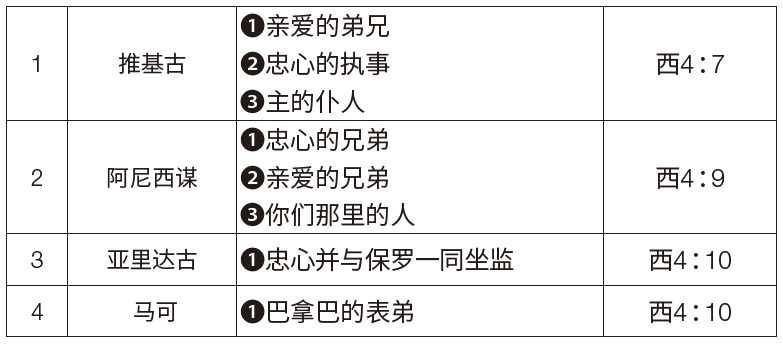
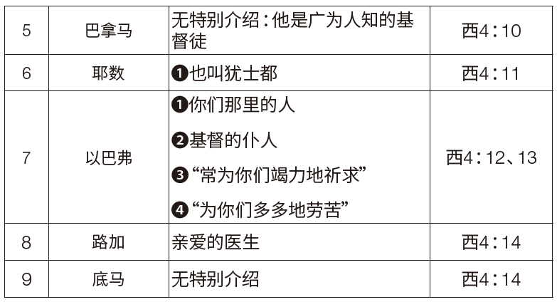

### 第一部份：概述

**存心节：帖前5：18**
**学习重点：西4：7–18**

保罗写给歌罗西人的最后一番话中，饱含了对教会深切的爱与关怀。他称推基古和阿尼西谋（编注：旧译名阿尼西母，今依新标点和合本译作阿尼西谋）为“亲爱的弟兄”（西4：7，9），称路加是“亲爱的医生”（西4：14）。保罗的心因爱而洋溢。他对同工的爱，正是他对教会之爱的写照。他对信众的爱与关怀表明，他渴望知道他们的情况并安慰他们（西4：8）。

保罗对歌罗西信徒的心愿是他们能“在上帝一切的旨意上得以完全，信心充足，站立得稳”（西4：12）。因此，他组建了一支“梦幻团队”来与他同工。事实上，〈歌罗西书〉第4章7-14节就像是一场阅兵，描绘出一群投身于最重要之属灵争战的勇敢的基督精兵。保罗教导我们，传道需要团队合作。在服事歌罗西教会的过程中，推基古和阿尼西谋冲在最前线，他们是保罗派遣的代表，负责传递与收集消息（西4：7-9）。然而，保罗的其他同工也都深深牵挂着歌罗西信徒（西4：10-14）。

本周课程包含三个主题：
1. 布道需要人们紧密合作、共同努力。
2. 因为布道需要团队协作，因此教会领袖和宣教士们必须怀抱着明确的目标工作，使教友们“得以完全，信心充足，站立得稳”（西4：12）。
3. 对耶稣深切的爱，可以将向世俗标准和物质主义妥协的可能性摒除。

### 第二部份：注释

**传道包含团队工作**
耶稣十分强调团队合作的重要性。例如，在〈路加福音〉第5章，我们看到耶稣在革尼撒勒湖边，他“见有两只船湾在湖边；打鱼的人却离开船洗网去了”（路5：1、2）。这些人因为什么都捕不到，已经放弃了！耶稣吩咐他们再次撒网“打鱼”（路5：4）。“他们下了网，就圈住许多鱼，网险些裂开。”（路5：6）如此一来，这在船上的人便“招呼那只船上的同伴来帮助”（路5：7）。无论是对他们还是对我们，这是多么令人印象深刻的一课啊！现在耶稣可以说：“从今以后，你要得人了。”（路5：10）

〈歌罗西书〉第4章7-14节体现出保罗对团队合作的重视（另见林前3：5-9）。他在宣教工作上并不孤独。在这一段经文中，保罗提到了一支由九人组成的宣教团队！我们可以从他描述他们参与福音使命的方式上得到宝贵的启示。

上表显示出保罗有一支梦幻团队。传道工作不是一支独舞，越多人参与到传道工作中，成果就会越好。当然，队伍中也会有几乎无名的传道者，例如“耶数又称为犹士都”（西4：11）。整本新约圣经中唯一提到他的地方，就是这节经文。值得注意的是，保罗并没有对底马多做评论（西4：14）。或许保罗的沉默已经说明了问题，他对于底马已经无话可说，也许底马的信仰根基已经动摇，就像他在〈提摩太后书〉第4章10节中提到的那样。另外，保罗的传教队伍中既有犹太人，也有外邦人。在信仰的合一中，人与人之间的差异消弭了。

另外还有一些值得注意的地方：

第一，推基古和阿尼西谋被称为亲爱的和忠心的。

第二，阿尼西谋和以巴弗都是“你们那里的人”，说明他们本就是歌罗西教会的信徒。

第三，保罗接着说以巴弗是“作基督耶稣仆人的”，常常祈祷，对教会充满热忱。虽然他不在歌罗西，但他“常为你们竭力地祈求”，“多多地劳苦”（西4：12、13）。从他身上我们可以学到宝贵的一课：即使无法亲自帮助，也可以借着祷告伸出援手。

第四，其中有几位在〈使徒行传〉中出现过，是保罗布道旅行的同工（亚里达古【徒19：29；20：4、5；27：2】；推基古【徒20：4】；巴拿巴【徒12：25；13：1–15；14：19–28】）。

第五，阿尼西谋是新归信的信徒（门10），将他纳入团队说明保罗十分重视培养人们传道，使他们成为自己的同工（西4：11）。

第六，起初，保罗不愿意再给马可第二次机会，因为他曾对传道工作犹豫不决（徒15：38），但后来他重新考虑这件事（西4：10；提后4：11），甚至最终他称马可为同工（门1：24）。

第七，保罗充满爱意的问候以及他代同工表达的致意，强化了教会领袖与会众之间的情谊。

**充足与完全**
基督徒领袖的工作必须有一个明确的目标：帮助信徒在信仰上成长，与上帝的心意完全契合。他们要为信徒努力并祈祷，希望他们成为“完全，信心充足”（西4：12）的人。乍看之下，保罗似乎是在提倡无罪或绝对的完美，但事实并非如此。“充足”对应的希腊文是teleios，最直接的含义是“成熟”（林前2：6；林前14：20；腓3：15）。而“完全”的希腊文plēroō用在人身上时，表示被上帝的属灵祝福充满（参见徒2：28；罗15：13）。保罗在〈以弗所书〉第4章13节指出，“在真道上同归于一，认识上帝的儿子”会让人“长大成人（成熟，teleios）”。

保罗希望歌罗西教会的信徒们能有像基督一样的品格。在前面的信中，他已经表达过这种想法（西2：6、7）。基督化的生活方式包括“在一切属灵的智慧悟性上，满心知道上帝的旨意”（西1：9），行事为人“对得起主”，蒙祂喜悦，“在一切善事上结果子”，“渐渐地多知道上帝”（西1：10）。属灵成熟的其余特征出现在〈歌罗西书〉第2章2节，保罗谈到要“因爱心互相联络”，为要“丰丰足足在悟性中有充足的信心”。总的来说，保罗认为传道的目标就是要“把个人在基督里完完全全地引到上帝面前”（西1：28；另见1：29）。

**提防物质主义**
圣经教导基督徒，不要效法这世界的价值观，更不要接受甚嚣尘上的物质主义（罗12：2）。然而，底马却陷入了贪爱世界的陷阱之中（提后4：10）。在〈罗马书〉第12章2节和〈提摩太后书〉第4章10节中，“世界”对应的希腊文都是aiōn，是指“与世俗社会相关的实践与标准体系”。──约翰内斯．P．洛和尤金．阿尔伯特．尼达，《新约希腊文-英文词典：语义域分类》，第2版，第1卷（纽约：联合圣经公会，1996年），原文第507页。

除了aiōn之外，kosmos也常用于指代这世界中邪恶的价值观和运作体系。例如，使徒约翰曾用三句话来概括世俗体系运行的模式（参见约壹2：16）：“肉体的情欲、眼目的情欲，并今生的骄傲。”学者们一致认为，这三重世俗的欲望与骄傲构成了强烈的反物质主义的警告。无怪乎保罗对“今世”（多2：12）有着如此负面的看法，以至于要强调耶稣“为我们的罪舍己，要救我们脱离这罪恶的世代”。在〈提摩太前书〉第6章17节中，保罗嘱咐“那些今世富足的人，不要自高，也不要倚靠无定的钱财；只要倚靠那厚赐百物给我们享受的上帝”。在〈提多书〉第2章12节中，使徒指出基督徒应当除去“不敬虔的心和世俗的情欲”，并在“今世”以“自守、公义、敬虔度日”。

值得注意的是，底马对世界的贪爱，正好解释了保罗所说的他“离弃我……去了”（提后4：10），表明他放弃了宣教的责任。当人贪爱世界时，一个明确的标志就是内心对宣教的热忱渐渐冷却。那些对来世有着深切盼望的人，就会“自守、公义、敬虔度日”（多2：12）；这种盼望必然体现在积极参与宣教的事上。

### 第三部份：应用

默想下列主题。引导学生回答下列问题：

“保罗的信中充满强烈的情感，言辞中反映出他强烈的群体意识，他渴望与信徒同在，与他们有美好的团契。保罗绝不是独来独往的人。他更像是一位思念远方儿女的父亲……在他的书信中，这种集体性的思维一次次显现出来。对他个人来说，社交网络极其重要，同时也是传播福音这一共同使命的关键工具。”──本．威瑟林顿三世（Ben Witherington III），《保罗探求：重寻大数的犹太人》（伊利诺州唐格洛夫：校际出版社，1998年），原文第114页。

这段话揭示了保罗对于传扬福音之使命的全然委身。生活在世界历史末期的我们对于传福音的投身程度，难道还比不上一世纪的保罗和他的宣教团队吗？他们尽心竭力、同心合作，为了拓展上帝的国度。我们也同样受到呼召，要合一同行。在上帝的宇宙救赎计划中每个人都有应当扮演的角色。我们蒙召要帮助他人在属灵上成长，为来世做好准备。事实上，我们越是渴望那将要到来的世界，就会越在今世为主多多劳苦。我们对耶稣的爱也必保守我们，不向这世界的价值观妥协，让我们虽然在这世间生活，却不属于这世界（约15：19）。

*问题：*
`1. 为什么我们的社交圈对于事工如此重要？在你的社交圈中有哪些人？在你的宣教工作和为上帝作见证的事上，他们是如何帮助你的？`
`2. 上帝如何呼召你帮助他人在属灵生命上成长，并为天国做好准备？`
`3. 你对耶稣的爱如何帮助你免于向世俗价值观妥协？在世却不属世究竟是什么意思？`