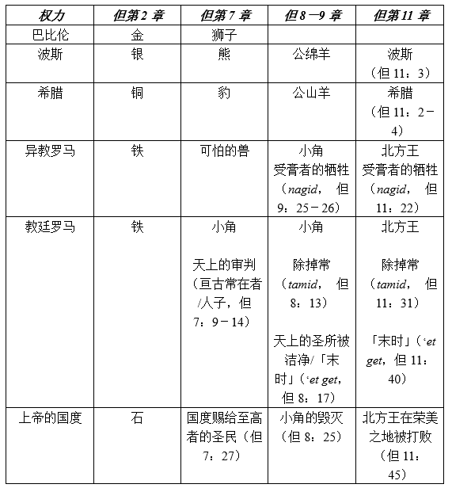

### 第一部分：概述
**关键经文：但11：35**
**研究焦点：但11；但8：3－8，20－22；赛46：9－10；但8：9，23－25；太27：33－50**

*引言：但以理书第11章无疑是本书中最困难的一章。然而，预言的整体轮廓已经显露。上帝的子民将受到迫害和攻击，但最终上帝会获胜。在这一课，我们将看到北王和南王之间的大战以及本章最后事件的画面。*

**学课主题**
1. **大争斗**。天使在但10：1中所提到的「大争斗」在整个第11章中展开，作为北方和南方统治者的继承事件，他们相互争斗直到结束。
2. **最后的事件**。本章的最后一章最终导致了邪恶势力的毁灭，因为他们发动了对锡安的最后一次攻击，就是上帝「荣美的圣山」。

**生活应用**
在北方和南方统治者之间的许多战斗背后只有一场大斗争。这是上帝和撒旦之间的争战，也对世上的政治和社会造成影响。这场战争主要不是关于领土或物质。这是人类心灵和思想的战争。在这场战斗中，中立是不可能的；我们必须选择一个阵营。

### 第二部分：注释

如上述学课主题，让我们更深入研读：

1. **大争斗**。南北之间的战争让人想起了为了争夺应许之地，各个权力之间的冲突。在当时的大帝国之间，以色列的土地经常沦为各国强夺的对象。北方的强国（亚述人、巴比伦人、塞琉古人）与南方强国（埃及人、托勒密人）为了战略因素都企图控制巴勒斯坦。很明显地，为了圣地的争夺战，上帝的子民就注定受苦。正如加百列所说，预言的目的是要使但以理「明白本国之民日后必遭遇的事，因为这异象关乎后来许多的日子」（但10：14）。所以，不同时期出现的王国和他们所打的战争是相关的，因为它们使上帝的子民经历了巨大的痛苦。随着预言事件的展开，南北战争的高潮是对锡安山上上帝子民的攻击。这最后的战斗，以及上帝介入好拯救祂的子民，是但以理信息的顶点。  

我们在本章的诠释中应用历史解释法时必须明白，随着预言的时间表经过了骷髅地，预言的表号和它们所代表的事件必须根据新约的术语来解释。在基督里，与以色列所立的约也给了外邦人，应许之地的范围扩大到包括整个世界。我们必须考虑弥赛亚带来的新现实，因为我们解释了但以理书第11章中所描述的预言事件。

因此，多数运用历史解释法的学者了解到，北方王最初是指位于叙利亚的塞琉古，而统治埃及的托勒密就代表南方王。随后，北方王的角色由异教罗马接管，之后被罗马教廷取代。同样，在预言的时间轴中南方代表了无神论，而无神论是由法国大革命大力推动的，并且一直持续到今天。

在但以理书第11章中，权力的转移仍是辩论的焦点所在。因此，我们应该把重点放在那些明确的事项上，因为它们与但以理书其他的预言大纲是平行的。以下列表显示了第11章与但以理书其他预言，尤其是第8章的相关性。

2. **最后的事件**。最后一段（但11：40－45）表明北方王和南方王之间的长期战争在结束时达到了尖峰。那时，北方王战胜了南方王，又对锡安山发动了最后的攻击。因为这里描述的大多数事件都是在将来才会发生，所以它们的解释仍然是暂定的；因此，我们应该避免教条主义。然而，应用两种解释的基本原则，仍可以描绘出预言的轮廓。首先，我们必须明白预言中预示的事件是以从旧约以色列及其实际制度中所获得的意象和语言描绘的。第二，这种意象和语言是基督带给普世教会的实际预表。

根据上述原则，南方王代表埃及，与整个预言指出的相符。反之，北方王便是巴比伦，这在旧约中显示为来自北方的力量（耶1：14；耶4：5－7；耶6：1；耶10：22；耶13：20；耶16：15；耶20：4；耶23：8；耶25：9，12）。宁录（Nimrod）创立的巴比伦成了外邦宗教以及耶路撒冷的头号敌人。在末日象征中，巴比伦象征着异教和罗马教廷。因此，在这一点与预言的时间表上，也就是末时，巴比伦/北方王象征教皇制及其支持的力量。反之，埃及代表了反方、最终被教皇制服的力量。因此，就其它可能性—如前鄂图曼帝国—埃及最有可能代表无神论和世俗主义。

因为北方王入侵「荣美之地」，我们被告知「以东人、摩押人，和一大半亚扪人」（但11：41）从他压倒性的权力中逃脱。因为这三个国家早已不存在了，它们必须被解释为更广泛之末世实体的象征。为了更了解与这些国家有关的象征意义，我们应该注意到，「荣美之地」指的不是中东的某处，而是上帝余民的象征。同样地，「以东人、摩押人、亚扪人」并不是指实际族裔，他们代表那些抗拒巴比伦诱惑的人，来自不同的信仰和哲学传统，在末日的时候加入了余民。

最后漫长的战争将发生在北方王将「在海和荣美的圣山中间设立他如宫殿的帐幕」（但11：45）。这种情况呼应了那国外的王，来自北方攻击耶路撒冷。例如，西拿基立在地中海和耶路撒冷之间的拉吉（Lachish）建立了他的军事帐幕。这些象征着对上帝的子民之属灵巴比伦的力量（教皇制及其盟友）之间的最终对抗。「荣美的圣山」代表上帝在基督主权之下的子民。所以，沿用古以色列和犹大经验的言词，预言描绘了末日巴比伦对上帝子民的攻击。但是，敌人会失败，「到了他的结局，必无人能帮助他」（但11：45）。

### 第三部分：生活应用

「在人类历史的记录中，国家的成长，邦国的兴衰，似乎有赖于人的意志和武力；而事态的形成似乎大都取决于人的权势、野心、或反复无常的意愿。但在上帝的圣言中，幔子已掀开，使我们从世人的利益、权势、和情感所引起之千变万化的冲突的上面，幕后，或其中，都可看出那位大有慈悲之主的许多媒介，正在默然忍耐地实现祂自己旨意的训令。」──怀爱伦，《先知与君王》，原文第499－500页。

`1.	但以理书第11章显示了上帝对未来历史了如指掌。上帝的预知如何加强了你个人的信心呢？`

`2.	但以理书第11章（尤其是但11：40－45）一直都是引起多方揣测的主题。末世预言中所概括的观念（见第一课）如何帮助我们正确理解这一章？`

`3.	了解但以理书的预言反映的大争斗后，我们应该对这知识做出什么样的响应（但11：33）？`
