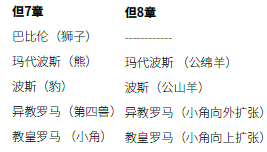

本周研究的预言大纲，在宗教改革后的新教历史主义者中获得了绝对的支持。但是2300日预言和查案审判的教导并没有被仔细查考或研究，直到19世纪早期的米勒耳运动才兴起。请看下列图表：

`阅读但7：9-14；8：14，26。根据这些经文，在天国发生了什么事？`

中世纪的迫害时期结束于1798年，最终教皇被贝尔蒂埃将军（启13：3）逮捕并监禁，在此之后，但7、8章谈到了审判。审判是在天上举行，就在上帝「坐着行审判」（启7：10）的地方，「有一位像人子的，驾着天云而来，被领到亘古常在者面前」（但7：13）。这个审判的场景发生在1798年之后，结束于耶稣复临之前。

但7章中审判的场景与但8：14的洁净圣所是平行的。它们记载的启示是同一件事。根据但8：14，「圣所就必洁净」的日子，也就是我们所说的赎罪日，就是2300日。用一日顶一年的原则解释，这段日子就是2300年。

但9：24提到2300日的起点。其中七十个七（490年）的预言是从2300日的异象（但9：24）中「截出来」的，原文是「chatak」。实际上，有许多学者正确地将但8：14中2300日（年）的预言和但9：24-27中七十个七（490）的预言视为同一预言的两个时间段。接下来但9：25也是关于七十个七的预言，并给出了这一预言的起始点：「从出令重新建造耶路撒冷。」这件事情发生在「亚达薛西王第七年」（拉7：7），即西元前457年。在此基础上加上2300年，就到了1844年，也就是在1798年后不久，且在耶稣复临之前。就在那时，耶稣进入至圣所，开始代求的工作，洁净天上的圣所。参见星期五进修资料中的图表。
