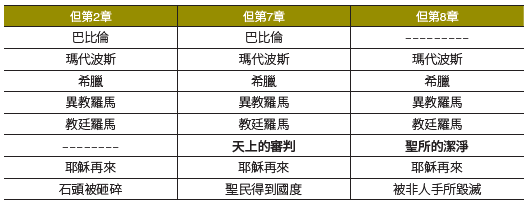

以下的圖表總結了我們到目前為止關於但以理書第2、7和8章描述的帝國時期。關於潔淨聖所，這張圖表告訴了我們什麼？

正如我們在這裡看到的，各章之間互有相似之處。在這些國度的敘述上不僅互通，但以理書第7章中的審判場景，就是教廷羅馬的1260年之後（主後538－1798年）更是直接與潔淨聖所有關，就是在但以理書第8章出現羅馬之後也是如此。簡而言之，但以理書第7章的天上審判──導致世界末日的審判──與但以理書第8章中對聖所的潔淨都直指同一回事。我們在此看見了同樣事物的兩種不同描述，兩者的發生都經過了1260年之小角力量的迫害期。

**討論問題**

`1. 以上的圖表如何向我們表明，潔淨聖所──與但以理書第7章的審判相同，必須在小角預言的1260年之後的某個時間點、然而卻是在上帝的最後國度建立之前才發生？`

`2. 但以理書第8章的預言將歷史描述成暴力和充滿邪惡的事物。象徵著兩個世界帝國的兩隻動物互相爭鬥（但8：8－12）。在他們之後所產生的小角是一種暴力和迫害的力量（但8：23－25）。因此，《聖經》在這裡並沒有試圖淡化這世界苦難的現實。這應該如何幫助我們學會相信上帝和祂的善良，儘管我們不免會看見處處環伺的邪惡現實？`
