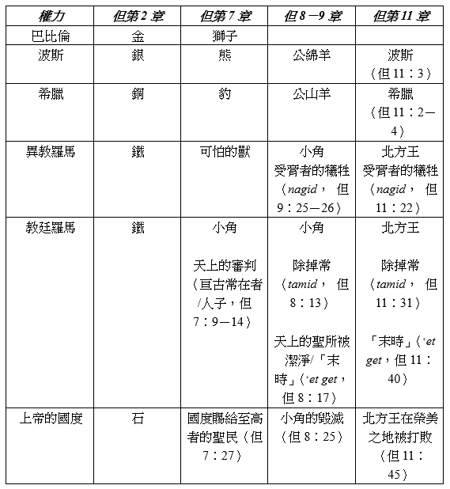

### 第一部分：概述
**關鍵經文：但11：35**
**研究焦點：但11；但8：3－8，20－22；賽46：9－10；但8：9，23－25；太27：33－50**

*引言：但以理書第11章無疑是本書中最困難的一章。然而，預言的整體輪廓已經顯露。上帝的子民將受到迫害和攻擊，但最終上帝會獲勝。在這一課，我們將看到北王和南王之間的大戰以及本章最後事件的畫面。*

**學課主題**
1. **大爭鬥**。天使在但10：1中所提到的「大爭鬥」在整個第11章中展開，作爲北方和南方統治者的繼承事件，他們相互爭鬥直到結束。
2. **最後的事件**。本章的最後一章最終導致了邪惡勢力的毀滅，因為他們發動了對錫安的最後一次攻擊，就是上帝「榮美的聖山」。

**生活應用**
在北方和南方統治者之間的許多戰鬥背後只有一場大鬥爭。這是上帝和撒旦之間的爭戰，也對世上的政治和社會造成影響。這場戰爭主要不是關于領土或物質。這是人類心靈和思想的戰爭。在這場戰鬥中，中立是不可能的；我們必須選擇一個陣營。

### 第二部份：注釋

如上述學課主題，讓我們更深入研讀：

1. **大爭鬥**。南北之間的戰爭讓人想起了為了爭奪應許之地，各個權力之間的衝突。在當時的大帝國之間，以色列的土地經常淪為各國強奪的對象。北方的強國（亞述人、巴比倫人、塞琉古人）與南方強國（埃及人、托勒密人）為了戰略因素都企圖控制巴勒斯坦。很明顯地，為了聖地的爭奪戰，上帝的子民就注定受苦。正如加百列所說，預言的目的是要使但以理「明白本國之民日後必遭遇的事，因爲這異象關乎後來許多的日子」（但10：14）。所以，不同時期出現的王國和他們所打的戰爭是相關的，因為它們使上帝的子民經歷了巨大的痛苦。隨著預言事件的展開，南北戰爭的高潮是對錫安山上上帝子民的攻擊。這最後的戰鬥，以及上帝介入好拯救祂的子民，是但以理信息的頂點。  

我們在本章的詮釋中應用歷史解釋法時必須明白，隨著預言的時間表經過了骷髏地，預言的表號和它們所代表的事件必須根據新約的術語來解釋。在基督裏，與以色列所立的約也給了外邦人，應許之地的範圍擴大到包括整個世界。我們必須考慮彌賽亞帶來的新現實，因為我們解釋了但以理書第11章中所描述的預言事件。

因此，多數運用歷史解釋法的學者瞭解到，北方王最初是指位於叙利亞的塞琉古，而統治埃及的托勒密就代表南方王。隨後，北方王的角色由異教羅馬接管，之後被羅馬教廷取代。同樣，在預言的時間軸中南方代表了無神論，而無神論是由法國大革命大力推動的，並且一直持續到今天。

在但以理書第11章中，權力的轉移仍是辯論的焦點所在。因此，我們應該把重點放在那些明確的事項上，因為它們與但以理書其他的預言大綱是平行的。以下列表顯示了第11章與但以理書其他預言，尤其是第8章的相關性。

2. **最後的事件**。最後一段（但11：40－45）表明北方王和南方王之間的長期戰爭在結束時達到了尖峰。那時，北方王戰勝了南方王，又對錫安山發動了最後的攻擊。因為這裏描述的大多數事件都是在將來才會發生，所以它們的解釋仍然是暫定的；因此，我們應該避免教條主義。然而，應用兩種解釋的基本原則，仍可以描繪出預言的輪廓。首先，我們必須明白預言中預示的事件是以從舊約以色列及其實際制度中所獲得的意象和語言描繪的。第二，這種意象和語言是基督帶給普世教會的實際預表。

根據上述原則，南方王代表埃及，與整個預言指出的相符。反之，北方王便是巴比倫，這在舊約中顯示為來自北方的力量（耶1：14；耶4：5－7；耶6：1；耶10：22；耶13：20；耶16：15；耶20：4；耶23：8；耶25：9，12）。寧錄（Nimrod）創立的巴比倫成了外邦宗教以及耶路撒冷的頭號敵人。在末日象徵中，巴比倫象徵著異教和羅馬教廷。因此，在這一點與預言的時間表上，也就是末時，巴比倫/北方王象徵教皇制及其支持的力量。反之，埃及代表了反方、最終被教皇制服的力量。因此，就其他可能性—如前鄂圖曼帝國—埃及最有可能代表無神論和世俗主義。

因為北方王入侵「榮美之地」，我們被告知「以東人、摩押人，和一大半亞捫人」（但11：41）從他壓倒性的權力中逃脫。因為這三個國家早已不存在了，它們必須被解釋為更廣泛之末世實體的象徵。為了更瞭解與這些國家有關的象徵意義，我們應該注意到，「榮美之地」指的不是中東的某處，而是上帝餘民的象徵。同樣地，「以東人、摩押人、亞捫人」並不是指實際族裔，他們代表那些抗拒巴比倫誘惑的人，來自不同的信仰和哲學傳統，在末日的時候加入了餘民。

最後漫長的戰爭將發生在北方王將「在海和榮美的聖山中間設立他如宮殿的帳幕」（但11：45）。這種情况呼應了那國外的王，來自北方攻擊耶路撒冷。例如，西拿基立在地中海和耶路撒冷之間的拉吉（Lachish）建立了他的軍事帳幕。這些象徵著對上帝的子民之屬靈巴比倫的力量（教皇制及其盟友）之間的最終對抗。「榮美的聖山」代表上帝在基督主權之下的子民。所以，沿用古以色列和猶大經驗的言詞，預言描繪了末日巴比倫對上帝子民的攻擊。但是，敵人會失敗，「到了他的結局，必無人能幫助他」（但11：45）。

### 第三部份：生活應用

「在人類歷史的記錄中，國家的成長，邦國的興衰，似乎有賴於人的意志和武力；而事態的形成似乎大都取決於人的權勢、野心、或反復無常的意願。但在上帝的聖言中，幔子已掀開，使我們從世人的利益、權勢、和情感所引起之千變萬化的衝突的上面，幕後，或其中，都可看出那位大有慈悲之主的許多媒介，正在默然忍耐地實現祂自己旨意的訓令。」──懷愛倫，《先知與君王》，原文第499－500頁。

`1.	但以理書第11章顯示了上帝對未來歷史了如指掌。上帝的預知如何加強了你個人的信心呢？`

`2.	但以理書第11章（尤其是但11：40－45）一直都是引起多方揣測的主題。末世預言中所概括的觀念（見第一課）如何幫助我們正確理解這一章？`

`3.	瞭解但以理書的預言反映的大爭鬥後，我們應該對這知識做出什麼樣的響應（但11：33）？`
