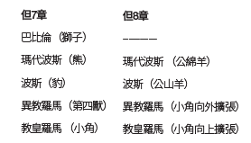

本週研究的預言大綱，在宗教改革後的新教歷史主義者中獲得了絕對的支持。但是2300日預言和查案審判的教導並沒有被仔細查考或研究，直到19世紀早期的米勒耳運動才興起。請看下列圖表：

`閱讀但7：9-14；8：14，26。根據這些經文，在天國發生了什麼事？`

中世紀的迫害時期結束於1798年，最終教皇被貝爾蒂埃將軍（啟13：3）逮捕並監禁，在此之後，但7、8章談到了審判。審判是在天上舉行，就在上帝「坐著行審判」（啟7：10）的地方，「有一位像人子的，駕著天雲而來，被領到亙古常在者面前」（但7：13）。這個審判的場景發生在1798年之後，結束於耶穌復臨之前。

但7章中審判的場景與但8：14的潔淨聖所是平行的。它們記載的啟示是同一件事。根據但8：14，「聖所就必潔淨」的日子，也就是我們所說的贖罪日，就是2300日。用一日頂一年的原則解釋，這段日子就是2300年。

但9：24提到2300日的起點。其中七十個七（490年）的預言是從2300日的異象（但9：24）中「截出來」的，原文是「chatak」。實際上，有許多學者正確地將但8：14中2300日（年）的預言和但9：24-27中七十個七（490）的預言視為同一預言的兩個時間段。接下來但9：25也是關於七十個七的預言，並給出了這一預言的起始點：「從出令重新建造耶路撒冷。」這件事情發生在「亞達薛西王第七年」（拉7：7），即西元前457年。在此基礎上加上2300年，就到了1844年，也就是在1798年後不久，且在耶穌復臨之前。就在那時，耶穌進入至聖所，開始代求的工作，潔淨天上的聖所。參見星期五進修資料中的圖表。
