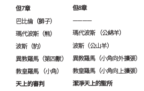

閱讀柯利弗德．戈德斯坦（CliffordGoldstein）的《1844年簡釋》，愛達荷州博伊西，太平洋出版社，1988年。另外，也可以從其他資料中尋找更多關於2300日預言的解釋，亦可搜尋網站：https://1844madesimple.org。研究下列圖表：

這裡需要注意的關鍵點是在但以理書第7章中審判的場景，發生在1260年的逼迫之後（但7：25），與但8：14中潔淨聖所的場景是一致的。這場天上的審判，最終導向這個墮落地球的悲慘歷史終於收尾，使上帝永恆的國度得以建立。因此，我們擁強有很大的聖經證據來證明但8：14及其象徵事件的重要意義。

**討論問題**

`1.	回顧但以理書2章。我們可以看到歷史研究法在此得以彰顯：世界各帝國接連登場，從古至今，直到上帝永恆國度的建立。上帝給了我們解讀這些預言的鑰匙。但是，今天很少有基督徒使用歷史研究法，這說明基督教世界處在什麼狀況？為什麼說這一事實有助於在當代凸顯出復臨信息對這個世界的迫切性？`

`2.	你對但8：14中2300日的預言瞭解多少呢？如果你不明白，何不花些時間學習，並與班上學員們分享呢？本會對這一預言的解釋相當經得起推敲，你也許會因此感到驚訝。`

`3.	閱讀但7：18，21-22，25，27。注意在聖民身上所發生的事？小角的勢力對他們做了什麼？而主又為他們做了什麼？論到審判，聖民有什麼可喜樂的呢？最終的審判將會帶給他們什麼？`
